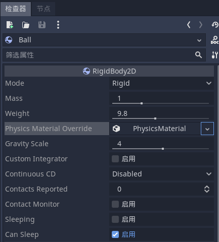
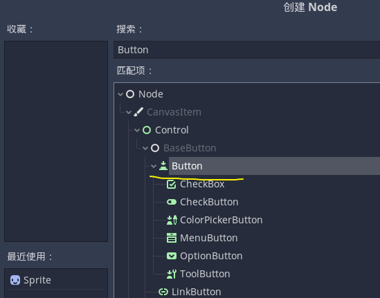
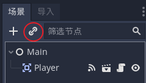

# 目录

[TOC]


# 常规

## 关于

### 介绍

```
func _ready():
    $Label.text = "Hello world!"
```

欢迎来到 Godot Engine 的官方文档，这是一个免费和开源的社区驱动的 2D 和 3D 游戏引擎，你会发现一个强大而用户友好的工具，你可以用它来开发任何类型的游戏，在任何平台上，没有任何使用限制。

此页面对引擎和本文档的内容进行了广泛的介绍，以便您知道如果您是初学者，或者如果您需要有关特定功能的信息，应该从哪里开始。

#### 在你开始之前

教程和资源页面列出了社区贡献的视频教程。如果您更喜欢视频而不是文本，那么这些可能值得一看。

如果您在使用其中一个教程或项目时遇到问题，您可以在各种社区渠道上找到帮助，尤其是 Godot Discord 社区、问答和 IRC。

#### 关于Godot引擎

游戏引擎是一个复杂的工具，因此很难用几句话来介绍 Godot。这是一个简短的概要，如果您需要快速撰写有关 Godot 引擎的文章，您可以自由地重复使用它。

​		Godot Engine 是一个功能丰富的跨平台游戏引擎，可从统一的界面创建 2D 和 3D 游戏。它提供了一套全面的常用工具，因此用户可以专注于制作游戏，而无需重新发明轮子。游戏可以一键导出到多个平台，包括主要的桌面平台（Linux、macOS、Windows）以及移动（Android、iOS）和基于网络的（HTML5）平台。

​		Godot 在宽松的 MIT 许可下是完全免费和开源的。没有附加条件，没有版税，什么都没有。用户的游戏是他们的，直到最后一行引擎代码。 Godot 的开发完全独立且由社区驱动，使用户能够帮助塑造他们的引擎以满足他们的期望。它得到了非营利软件自由保护协会的支持。

要更深入地了解引擎，建议您进一步阅读本文档，尤其是分步教程。

#### 关于文档

本文档由 Godot Engine 社区的成员不断编写、更正、编辑和修改。它通过 reStructuredText 标记语言的文本文件进行编辑，然后使用开源 Sphinx 和 ReadTheDocs 工具编译成静态网站/离线文档。

<font color='blue'>您可以通过在其 GitHub 源存储库上打开问题单或通过拉取请求发送补丁来为 Godot 的文档做出贡献，或者在 Hosted Weblate 上将其翻译成您的语言。</font>

所有内容均在许可的知识共享署名 3.0 (CC-BY 3.0) 许可下，归属于“Juan Linietsky、Ariel Manzur 和 Godot Engine 社区”。

#### 文档的结构

本文档分为五个部分，内容分布非常不平衡——但它的拆分方式应该相对直观：

- 一般部分包含此介绍以及有关引擎、其历史、许可、作者等的信息。它还包含常见问题。
- 入门部分是本文档存在的理由，因为它包含有关使用引擎制作游戏的所有必要信息。它从分步教程开始，它应该是所有新用户的入口点。
- 教程部分可以根据需要以任何顺序阅读。它包含特定于功能的教程和文档。
- 开发部分面向高级用户和引擎开发贡献者，提供有关编译引擎、开发 C++ 模块或编辑器插件的信息。
- 社区部分提供了与为引擎开发和社区生活做出贡献相关的信息，例如如何报告错误、文档帮助等。它还指向各种社区渠道，如 IRC 和 Discord，并包含本文档之外的推荐第三方教程列表。
- 最后，类参考是Godot API的文档，它也可以直接在引擎的脚本编辑器中获得。它是由主源码库中的文件自动生成的，因此生成的文档文件是不可以修改的。详情请见贡献类参考文献。

除了本文档之外，您可能还想查看各种 Godot 演示项目

------

### 常见问题

#### 我可以用Godot做什么？它的成本是多少？许可证条款是什么？

Godot 是在 免费和开源软件（ [Free and Open-Source Software](https://en.wikipedia.org/wiki/Free_and_open-source_software)） 批准的 MIT 许可下提供的免费和开源软件。这意味着它是免费的，就像“言论自由”和“免费啤酒”一样。

简而言之：

- 你可以自由下载和使用Godot，用于任何目的：个人、非营利、商业或其他。
- 你可以以任何理由随心所欲自由地修改、分发、再分发和重新混合Godot，包括非商业性的和商业性的。

此随附文档的所有内容均在许可的知识共享署名 3.0 (CC-BY 3.0) 许可下发布，并归属于“Juan Linietsky、Ariel Manzur 和 Godot Engine 社区”。

<font color='red'>徽标和图标通常在相同的知识共享许可下。请注意，Godot 源代码中包含的一些第三方库可能具有不同的许可证。</font>

有关完整的详细信息，请查看 Godot 存储库中的 COPYRIGHT.txt 以及 LICENSE.txt 和 LOGO_LICENSE.txt 文件。

另外，请看Godot网站上的许可证页面。

#### Godot 支持哪些平台？

对于编辑器：

- Windows

- macOS
- X11 (Linux, *BSD)
- Web
- Android (experimental)

导出游戏：

- Windows (and UWP)
- macOS
- X11 (Linux, *BSD)
- Android
- iOS
- Web

同时支持32位和64位的二进制文件，64 是默认值。

一些用户还报告说，在基于ARM的系统上，如Raspberry Pi，成功构建和使用Godot。

此外，还有一些非官方的第三方工作正在为某些控制台进行构建。但是，目前这些都不包含在默认构建脚本或导出模板中。

有关这方面的更多信息，请参阅有关自己导出和编译 Godot 的部分。

#### Godot 支持哪些编程语言？ 

Godot官方支持的语言有GDScript、Visual Scripting、C#和C++。请查看脚本部分中每种语言的子类别。

如果你刚开始接触Godot或一般的游戏开发，GDScript是推荐学习和使用的语言，因为它是Godot的原生语言。虽然从长远来看，脚本语言的性能往往不如低级语言，但对于原型设计、开发最小可行产品（MVP）以及关注上市时间（TTM）来说，GDScript将提供一种快速、友好、有能力的游戏开发方式。

请注意，对C#的支持仍然相对较新，因此，你在使用过程中可能会遇到一些问题。我们友好而勤奋的开发社区随时准备解决出现的新问题，但由于这是一个开源项目，我们建议你首先自己做一些尽职调查。通过对开放问题的讨论进行搜索是开始排除故障的一个好方法。

至于新的语言，可以通过第三方使用GDNative / NativeScript / PluginScript设施来支持。(见下面关于插件的问题。)目前正在进行的工作，例如，Godot与Python和Nim的非官方绑定。

#### 什么是 GDScript，我为什么要使用它？

GDScript 是 Godot 的集成脚本语言。它是从头开始构建的，旨在以最少的代码最大限度地发挥 Godot 的潜力，让新手和专业开发人员都能够尽快利用 Godot 的优势。如果您以前曾经使用 Python 之类的语言编写过任何东西，那么您会感到宾至如归。有关 GDScript 为您提供的强大功能的示例、历史和完整概述，请查看 GDScript 脚本指南。

使用GDScript有几个原因--特别是当你在做原型设计，处于项目的alpha/beta阶段，或者不是在创造下一个AAA级标题时--但最突出的原因是整体上减少了复杂性。

为 Godot 创建一个紧密集成的自定义脚本语言的初衷有两个：首先，它减少了启动和运行 Godot 所需的时间，为开发人员提供了一种快速的方式，让他们专注于引擎关于生产力；其次，它减少了维护的整体负担，减少了问题的维度，并允许引擎的开发人员专注于消除错误和改进与引擎核心相关的功能 - 而不是花费大量时间试图获得一个小的跨大量语言工作的一组增量功能。

由于 Godot 是一个开源项目，因此从一开始就必须优先考虑更集成和无缝的体验，而不是通过支持更熟悉的编程语言来吸引更多用户——尤其是当支持那些更熟悉的语言会导致更糟糕的体验时。我们了解您是否愿意在 Godot 中使用另一种语言（请参阅上面支持的选项列表）。话虽如此，如果您还没有尝试过 GDScript，请尝试三天。就像 Godot 一样，一旦你看到它的强大和你的开发变得多么迅速，我们认为 GDScript 会在你身上成长。

有关熟悉 GDScript 或动态类型语言的更多信息，请查阅 GDScript：动态语言简介教程。

#### 创建 GDScript 背后的动机是什么？

早期，引擎使用 Lua 脚本语言。 Lua 速度很快，但创建与面向对象系统的绑定（通过使用回退）既复杂又缓慢，并且需要大量代码。在对 Python 进行了一些实验后，它也被证明难以嵌入。

为 Godot 创建自定义脚本语言的主要原因是：

1. 大多数脚本 VM 中的线程支持较差，Godot 使用线程（Lua、Python、Squirrel、JavaScript、ActionScript 等）。
2. 大多数脚本虚拟机对类扩展的支持很差，并且适应 Godot 的工作方式效率非常低（Lua、Python、JavaScript）。
3. 许多现有语言都有糟糕的绑定到C++的接口，导致了大量的代码、错误、瓶颈和普遍的低效(Lua、Python、Squirrel、JavaScript等)。我们希望专注于一个强大的引擎，而不是大量的集成。
4. 没有原生向量类型（vector3、matrix4 等），导致在使用自定义类型（Lua、Python、Squirrel、JavaScript、ActionScript 等）时性能大大降低。
5. 垃圾收集器会导致停顿或不必要的大量内存使用（Lua、Python、JavaScript、ActionScript 等）。
6. 难以与代码编辑器集成以提供代码完成、实时编辑等(所有这些功能)。这一点得到了GDScript的很好支持。

GDScript旨在减少上述问题，甚至更多。

#### Godot 支持哪些类型的 3D 模型格式？

Godot 通过 OpenCollada 导出器（Maya、3DSMax）支持 Collada。如果您使用的是 Blender，请查看我们自己的 Better Collada Exporter。

从 Godot 3.0 开始，支持 glTF。

通过 Open Asset Import 库支持 FBX。但是，FBX 是专有的，因此如果适合您的工作流程，我们建议使用上面列出的其他格式。

#### Godot会支持插入封闭的SDK比如FMOD？

Godot 的目标是创建一个免费的开源 MIT 许可引擎，它是模块化和可扩展的。核心引擎开发社区没有计划支持任何第三方、闭源/专有 SDK，因为与这些 SDK 集成将违背 Godot 的精神。

也就是说，因为 Godot 是开源和模块化的，所以没有什么能阻止您或其他任何人有兴趣将这些库添加为模块并与它们一起发布您的游戏——无论是开源的还是闭源的。

要了解如何为您选择的 SDK 提供支持，请查看下面的插件问题。

如果你知道有一个第三方SDK不被Godot支持，但提供免费和开源的集成，请考虑自己开始集成工作。Godot不是一个人的，它是属于社区的，它与像你这样雄心勃勃的社区贡献者一起成长。

#### 如何在我的系统上安装 Godot 编辑器（用于桌面集成）？

由于您不需要在系统上实际安装 Godot 来运行它，这意味着桌面集成不会自动执行。有两种方法可以克服这一点。您可以从 Steam（所有平台）、Scoop (Windows)、Homebrew (macOS) 或 Flathub (Linux) 安装 Godot。这将自动执行桌面集成所需的步骤。

或者，您可以手动执行安装程序将为您执行的步骤：

**Windows**

- 将 Godot 可执行文件移动到一个稳定的位置（即在您的下载文件夹之外），这样您就不会意外移动它并在将来破坏快捷方式。
- 右键单击 Godot 可执行文件并选择创建快捷方式。
- 将创建的快捷方式移动到 %LOCALAPPDATA%\Microsoft\Windows\Start Menu\Programs。这是将出现在“开始”菜单中的快捷方式的用户范围位置。您还可以通过右键单击可执行文件并选择固定到任务栏来将 Godot 固定在任务栏中。

**MacOS**

将解压的 Godot 应用程序拖到 /Applications/Godot.app，然后根据需要将其拖到 Dock 中。只要 Godot 在 /Applications 或 ~/Applications 中，Spotlight 就能找到它。

**Linux**

- 将 Godot 二进制文件移动到一个稳定的位置（即在您的下载文件夹之外），这样您就不会意外移动它并在将来破坏快捷方式。
- 重命名 Godot 二进制文件并将其移动到 PATH 环境变量中存在的位置。这通常是 /usr/local/bin/godot 或 /usr/bin/godot。这样做需要管理员权限，但这也允许您通过输入 godot 从终端运行 Godot 编辑器。
  - 如果您无法将 Godot 编辑器二进制文件移动到受保护的位置，则可以将二进制文件保存在主目录中的某个位置，并修改下面链接的 .desktop 文件中的 Path= 行以包含 Godot 二进制文件的完整绝对路径。

- 将此 .desktop 文件保存到 $HOME/.local/share/applications/。如果您有管理员权限，您还可以将 .desktop 文件保存到 /usr/local/share/applications 以使所有用户都可以使用该快捷方式。

#### Godot 编辑器是可移植的应用程序吗？

在其默认配置中，Godot 是半便携式的。它的可执行文件可以从任何位置（包括不可写位置）运行，并且从不需要管理员权限。

然而，配置文件将被写入用户范围内的配置或数据目录中。这通常是个好办法，但这意味着如果你复制了包含Godot可执行文件的文件夹，配置文件将不会在不同的机器上传播。更多信息请参见Godot项目中的文件路径。

如果需要真正的便携式操作（例如在 USB 记忆棒上使用），请按照独立模式中的步骤操作。

#### 为什么 Godot 使用 Vulkan 或 OpenGL 而不是 Direct3D？

Godot 的首要目标是跨平台兼容性和开放标准。 OpenGL 和 Vulkan 是在所有平台上（几乎）开放和可用的技术。由于这个设计决策，在 Windows 上使用 Godot 开发的项目将在 Linux、macOS 等上开箱即用。

由于 Godot 只有几个人在使用它的渲染器，所以我们希望维护更少的渲染后端。最重要的是，在所有平台上使用单个 API 可以实现更高的一致性，同时减少特定于平台的问题。

从长远来看，我们可能会为Godot开发一个Direct3D 12渲染器（主要用于Xbox的目的），但Vulkan和OpenGL仍将是所有平台上的默认渲染后端，包括Windows。

为什么Godot的目标是保持其核心功能集的小型化？

#### Godot有意不包括那些可以通过附加组件实现的功能，除非它们被经常使用。这方面的一个例子是高级人工智能功能？

这方面有几个原因：

- **代码维护和bug表面。**每次我们在 Godot 存储库中接受新代码时，现有的贡献者通常会负责维护它。一些贡献者在合并他们的代码后并不总是留下来，这会使我们难以维护有问题的代码。这可能导致功能维护不善，并且存在永远无法修复的错误。最重要的是，需要测试和检查回归的“API 表面”随着时间的推移不断增加。
- **贡献的容易性。**通过保持代码库的小而整洁，它可以保持快速和易于从源码编译。这使得新的贡献者更容易开始使用Godot，而不要求他们购买高端硬件。
- **保持编辑器的二进制大小较小。**不是每个人都有快速的互联网连接。确保每个人都可以下载 Godot 编辑器，将其解压缩并在 5 分钟内运行，从而使所有国家/地区的开发人员都可以更轻松地访问 Godot。
- **保持出口模板的二进制大小较小。**这直接影响使用 Godot 导出的项目的大小。在移动和 Web 平台上，保持较小的文件大小对于确保在功率不足的设备上快速安装和加载至关重要。同样，有许多国家的高速互联网并不容易获得。除此之外，这些国家通常会实施严格的数据使用上限。

由于上述原因，我们必须有选择地接受Godot的核心功能。这就是为什么我们的目标是在Godot的未来版本中把一些核心功能转移到官方支持的附加组件中。就二进制大小而言，这样做的好处是让你只为你的项目中实际使用的功能付费。(同时，你可以在编译自定义导出模板时禁用未使用的功能，以优化你的项目的分布大小）。

#### 应该如何创建资产以处理多种分辨率和长宽比？

这个问题经常出现，这可能是由于Apple最初将设备分辨率翻倍时造成的误解。这让人们认为在不同的分辨率下拥有相同的资产是一个好主意，所以许多人继续朝着这条道路前进。这最初只适用于 Apple 设备，但随后创建了几个具有不同分辨率和纵横比的 Android 和 Apple 设备，具有非常广泛的尺寸和 DPI。

实现这一目标的最常见和最恰当的方法是，为游戏使用一个单一的基本分辨率，只处理不同的屏幕长宽比。这主要是2D需要的，因为在3D中，这只是一个相机XFov或YFov的问题。

1. 为您的游戏选择一个基本分辨率。即使有高达 2K 的设备和低至 400p 的设备，您的设备中的常规硬件缩放也会以很少或没有性能成本来解决这个问题。最常见的选择是接近 1080p (1920x1080) 或 720p (1280x720)。请记住，分辨率越高，资产越大，它们占用的内存就越多，加载时间就越长。
2. 使用Godot中的拉伸选项；在保持长宽比的情况下进行2D拉伸效果最好。请查看多分辨率教程，了解如何实现这一点。
3. 确定一个最小的分辨率，然后决定是否要让你的游戏为不同的长宽比进行垂直或水平拉伸，或者有一个长宽比而你想让黑条出现。这一点在多分辨率中也有解释。
4. 对于用户界面，使用锚定来确定控件应该停留和移动的位置。如果用户界面比较复杂，可以考虑学习一下容器。

就这样了! 你的游戏应该可以在多种分辨率下运行。
如果有意愿让你的游戏也能在小屏幕（宽度小于300像素）的古老设备上运行，你可以使用导出选项来缩小图像，并将该构建设置为用于App Store或Google Play的特定屏幕尺寸。

#### 如何扩展 Godot？

要扩展 Godot，例如创建 Godot 编辑器插件或添加对其他语言的支持，请查看 EditorPlugins 和工具脚本。

另外，请查阅有关这些主题的官方博客文章：

- <a href = "[Godot Engine - A look at the GDNative architecture](https://godotengine.org/article/look-gdnative-architecture)">看一看GDNative架构</a>

- <a href = "[Godot Engine - GDNative is here!](https://godotengine.org/article/dlscript-here)">GDNative在这！</a>

您还可以查看 GDScript 实现、Godot 模块以及对 Godot 的非官方 Python 支持。这将是了解另一个第三方库如何与 Godot 集成的一个很好的起点。

#### Godot的下一个版本什么时候出？

什么时候准备好！请参阅下一个版本何时发布？了解更多信息。

#### 我愿意贡献！我该如何开始？

棒极了! 作为一个开源项目，Godot的发展离不开像你这样的开发者的创新和雄心。
首先要从问题入手。找到一个与你有共鸣的问题，然后进入 "如何贡献 "指南，学习如何分叉、修改和提交一个带有你的修改的Pull Request（PR）。

#### 我有一个关于Godot的好主意。我怎样才能分享它呢？

你可能很想给Godot带来一些想法，比如导致大规模核心变化的想法，对其他游戏引擎的某种模仿，或者你希望在编辑器中建立其他工作流程。这些都很好，我们很感谢有这样积极的人愿意做出贡献，但Godot的重点永远是路线图中列出的核心功能，消除错误和解决问题，以及Godot社区成员之间的交流。

Godot 社区中的大多数开发人员会更有兴趣了解以下内容：

- 你使用该软件的经验和你遇到的问题（我们关心这一点比关心如何改进它的想法要多得多）。

- 你希望看到实现的功能，因为你的项目需要它们。

- 在学习该软件时难以理解的概念。

- 你希望看到的工作流程的优化部分。

- 你错过了清晰的教程或文档不清楚的部分。

请不要觉得你对Godot的想法是不受欢迎的。相反，请先尝试将它们重新表述为一个问题，这样开发者和社区就有了一个功能性的基础，可以将你的想法建立起来。

与社区分享您的想法和问题的一个好方法是作为一组用户故事（User Story 是用户需求的简化表达）。解释你想要做什么，你期望发生什么行为，然后实际发生了什么行为。以这种方式构建问题和想法将有助于整个社区专注于改善整个开发人员的体验。

提供屏幕截图、具体数字、测试用例或示例项目(如果适用)的奖励积分。

#### 是否可以使用 Godot 创建非游戏应用程序？

是的! Godot具有广泛的内置UI系统，其较小的发行量可以使它成为Electron或Qt等框架的合适替代品。

创建非游戏应用程序时，请确保在项目设置中启用低处理器模式以减少 CPU 和 GPU 使用率。

也就是说，我们不建议使用 Godot 创建移动应用程序，因为移动平台尚不支持低处理器模式。
查看 Material Maker 和 Pixelorama，了解使用 Godot 制作的开源应用程序示例。

#### 是否可以将 Godot 用作库？ 

Godot 旨在与其编辑器一起使用。我们建议您试一试，因为从长远来看，它很可能会节省您的时间。没有计划将 Godot 用作库，因为它会使引擎的其余部分更加复杂，并且对于普通用户来说难以使用。

如果您想要使用渲染库，请考虑使用已建立的渲染引擎。请记住，与GoDot相比，渲染引擎通常有更小的社区。这将使您的问题更难找到答案。

#### Godot使用什么用户界面工具包？

Godot 不使用标准的 GUI 工具包，如 GTK、Qt 或 wxWidgets。相反，Godot 使用自己的用户界面工具包，使用 OpenGL ES 或 Vulkan 渲染。该工具包以控制节点的形式公开，用于渲染编辑器（用 C++ 编写）。这些控制节点也可以在 Godot 支持的任何脚本语言的项目中使用。
此自定义工具包可以从硬件加速中受益，并在所有平台上具有一致的外观。最重要的是，它不必处理 GTK 或 Qt 附带的 LGPL 许可警告。最后，这意味着 Godot 正在“吃自己的狗粮（英语俚语，意思就是自己使用自己开发的产品）”，因为编辑器本身是 Godot UI 系统最复杂的用户之一。
这个自定义的 UI 工具包不能作为库使用，但你仍然可以使用 Godot 通过编辑器创建非游戏应用程序。

#### 为什么 Godot 不使用 STL（标准模板库）？

像许多其他库（以 Qt 为例）一样，Godot 不使用 STL。我们相信 STL 是一个很棒的通用库，<font color = "red">但我们对 Godot 有特殊要求。</font>

- STL 模板会创建非常大的符号，从而产生巨大的调试二进制文件。我们使用一些名称很短的模板来代替。
- 我们的大多数容器都满足特殊需求，例如 Vector，它使用写时复制，我们用来传递数据，或者 RID 系统，它需要 O(1) 访问时间来提高性能。同样，我们的哈希映射实现旨在与内部引擎类型无缝集成。
- 我们的容器内置了内存跟踪，这有助于更好地跟踪内存使用情况。
- 对于大型数组，我们使用池化内存，它可以映射到预先分配的缓冲区或虚拟内存。
- 我们使用我们自定义的 String 类型，因为 STL 提供的类型过于基础，缺乏适当的国际化支持。

#### 为什么 Godot 不使用异常？

<font color = "red">异常指程序运行时发生错误。异常处理就是对这些错误进行处理和控制。</font>

我们认为游戏不应该崩溃，无论如何。如果发生意外情况，Godot会打印一个错误（甚至可以追踪到脚本），但随后会尽量优雅地恢复并继续运行。

此外，异常会显着增加可执行文件的二进制大小。

#### 为什么 Godot 不强制执行 RTTI？

Godot 提供了自己的类型转换系统，可以选择在内部使用 RTTI。在 Godot 中禁用 RTTI 意味着可以实现更小的二进制大小，而性能成本很低。

#### 为什么 Godot 不强制用户实现 DoD（面向数据的设计）？

虽然Godot内部对于很多繁重的性能任务都试图尽可能地使用缓存一致性，但我们相信大多数用户并不真的需要被迫使用DoD的做法。

DoD主要是一种缓存一致性的优化，只有在处理数以万计的对象（每一帧都要处理，而且很少修改）时才能为你带来明显的性能改进。就像，如果你每一帧只移动几百个精灵或敌人，DoD对你没有帮助，你应该考虑采用不同的优化方法。

绝大多数游戏都不需要这样做，Godot提供了方便的助手来完成大多数情况下的工作。

如果一个游戏真的需要处理如此大量的对象，我们的建议是在高性能部分使用C++和GDNative，其余部分使用GDScript（或C#）。

#### 我如何支持 Godot 开发或贡献？

请查阅贡献方式。

#### 谁正在从事Godot的工作？我如何与你们联系？

见Godot网站上的相应页面。

------

### 故障诊断

本页列出了使用Godot时遇到的常见问题和可能的解决方案。

| 另见                                                         |
| ------------------------------------------------------------ |
| 关于Godot编辑器的HTML5版本的注意事项，请参见使用网络编辑器。 |

#### 我在编辑器或项目管理器中所做的一切都显得延迟了一帧。

这是Windows上英特尔图形驱动程序的一个已知错误。更新到英特尔提供的最新图形驱动程序版本应该可以解决这个问题。

你应该使用英特尔提供的图形驱动程序，而不是你的台式机或笔记本电脑制造商提供的驱动程序，因为他们的版本往往是过时的。

#### 当我在编辑器中旋转三维摄像机时，网格消失了，网格变成黑色。

这是Windows上英特尔图形驱动程序的一个已知错误。

目前唯一的解决方法是切换到GLES2渲染器。你可以在编辑器的右上角或项目设置中切换渲染器。

如果你使用的电脑允许你切换显卡，比如NVIDIA Optimus，你可以使用专用显卡来运行Godot。

#### 编辑或项目需要很长的时间来启动。

当你有特定的USB外围设备连接时，这是Windows上的一个已知错误。特别是Corsair的iCUE软件似乎会导致这个错误。尝试将你的USB外围设备的驱动程序更新到最新版本。如果这个错误仍然存在，你需要在打开编辑器之前断开有问题的外围设备。然后你可以再次连接外设。

#### 检查器和节点停靠中的编辑器工具提示在显示时会闪烁。

这是一个由Windows上的第三方Stardock Fences应用程序引起的已知问题。唯一已知的解决方法是在使用Godot时禁用Stardock Fences。

#### 点击系统控制台后，Godot编辑器出现冻结。

在Windows上运行Godot并启用系统控制台时，你可以通过点击命令窗口内的内容意外地启用选择模式。这种Windows特有的行为会暂停应用程序，让你在系统控制台中选择文本。Godot不能覆盖这种系统特有的行为。

为了解决这个问题，选择系统控制台窗口，并按回车键离开选择模式。

#### 一些文本，如 "NO DC "出现在项目管理器和编辑器窗口的左上角。

这是由于NVIDIA图形驱动程序注入了一个覆盖层来显示信息。

要想在Windows上禁用这种叠加，请在NVIDIA控制面板中将图形驱动程序设置恢复为默认值。

要想在Linux上禁用这种叠加，请打开nvidia-settings，进入X Screen 0 > OpenGL Settings，然后取消勾选Enable Graphics API Visual Indicator。

#### 项目窗口显示很模糊，与编辑器不同。

与编辑器不同的是，该项目默认情况下并不标记为DPI感知型。这样做是为了提高性能，特别是在集成显卡上，在高DPI下渲染3D场景会很慢。

为了解决这个问题，打开项目>项目设置，并启用显示>窗口>DPI>允许Hidpi。在此基础上，确保你的项目被配置为支持多种分辨率。

#### 当我运行项目时，项目窗口并没有出现在中心位置。

这是一个已知的错误。要解决这个问题，打开 "项目">"项目设置 "并启用 "显示">"窗口">"DPI">"允许Hidpi"。在此基础上，确保你的项目被配置为支持多种分辨率。

#### 当从编辑器中运行时，该项目可以工作，但当从导出的副本中运行时，无法加载一些文件。

这通常是由于忘记在 "导出 "对话框中为非资源文件指定一个过滤器造成的。默认情况下，Godot只将实际资源纳入PCK文件。一些常用的文件，如JSON文件，不被视为资源。例如，如果你在导出的项目中加载test.json，你需要在非资源导出过滤器中指定*.json。更多信息请参见资源选项。

在Windows上，这也可能是由于大小写的敏感性问题。如果你在脚本中引用的资源与文件系统中的大小写不同，一旦你导出项目，加载将失败。这是因为虚拟PCK文件系统是区分大小写的，而Windows的文件系统默认是不区分大小写的。

------

### 功能列表

本页旨在列出 Godot 当前支持的所有功能。

| 注意                                                         |
| ------------------------------------------------------------ |
| 此页面列出了当前稳定版 Godot (3.5) 支持的功能。最新开发版本 (4.0) 中提供了更多功能。 |

#### 特点

##### 平台

**能同时运行编辑器和导出的项目。**

- Windows 7 及更高版本（64 位和 32 位）。
- macOS 10.12 及更高版本（64 位、x86 和 ARM）。
- Linux（64 位和 32 位、x86 和 ARM）。
  - 二进制文件是静态链接的，如果在足够旧的基础发行版上编译，则可以在任何发行版上运行。
  - 官方二进制文件在 Ubuntu 14.04 上编译。

- HTML5 通过 WebAssembly（Firefox、Chrome、Edge、Opera）。

**运行导出的项目：**

- Android 4.4 and later.
- iOS 10.0 and later.
- [Consoles](https://docs.godotengine.org/en/stable/tutorials/platform/consoles.html#doc-consoles).
- [Headless Linux and macOS servers](https://docs.godotengine.org/en/stable/tutorials/export/exporting_for_dedicated_servers.html#doc-exporting-for-dedicated-servers).

Godot 的目标是尽可能独立于平台，并且可以相对轻松地移植到新平台。

#### 编辑器

**特点：**

- 场景树编辑器。

- 内置脚本编辑器。

- 支持外部脚本编辑器，如Visual Studio Code或Vim。
  - GDScript调试器。

- 还不支持在线程中调试。性能监控工具。

- 实时脚本重载。

- 实时场景编辑。
  - 更改将反映在编辑器中，并在关闭运行项目后保留。
    远程检查器。

- 更改不会反映在编辑器中，并且在关闭运行的项目后不会被保留。
  实时摄像机复制。
  - 移动编辑器中的摄像机，并在运行的项目中看到结果。

- 内置的离线类参考文档。

- 在社区贡献的几十种语言中使用编辑器。

**插件：**

- 编辑器插件可以从资产库中下载，以扩展编辑器的功能。

- 使用GDScript创建你自己的插件，增加新的功能或加快你的工作流程。

- 从项目经理的资产库中下载项目并直接导入。

#### 2D图形

**两个可用的渲染器：**

- OpenGL ES 3.0渲染器（在桌面平台上使用OpenGL 3.3）。
  - 高端的视觉效果。建议在桌面平台上使用。
- OpenGL ES 2.0 渲染器（在桌面平台上使用 OpenGL 2.1）。
  - 建议在移动和网络平台上使用。

**特点：**

- Sprite，多边形和线渲染。
  - 用于绘制线和多边形的高级工具，例如 Polygon2D 和 Line2D。

- AnimatedSprite作为创建动画精灵的辅助工具。
- 视差图层。
  - Pseudo-3D（伪3D）支持包括在编辑器中进行预览。

- 带有法线图的2D照明
  - 硬阴影或软阴影。

- 使用位图 (BitmapFont) 进行字体渲染或使用 FreeType (DynamicFont) 进行光栅化。
  - 位图字体可以用BMFont等工具导出。
  - DynamicFont支持单色字体以及彩色字体（例如用于表情符号）。支持的格式有TTF、OTF、WOFF1和WOFF2。
  - DynamicFont支持可调节宽度和颜色的可选字体轮廓。
  - 支持字体超采样，以便在更高的分辨率下保持字体清晰。

- 基于GPU的粒子，支持自定义粒子着色器。
- 基于 CPU 的粒子。

#### 2D 工具

- 具有内置平滑和拖动边距的 2D 相机。
- Path2D 节点表示 2D 空间中的路径。
  - 可以在编辑器中绘制或按程序生成。
  - PathFollow2D节点，使节点跟随Path2D。

- 2D 几何辅助类。
- Line2D 节点用于绘制带纹理的 2D 线。

#### 2D物理

**物理实体：**

- 静态实体
- 刚体
- 运动实体
- 关节
- 检测进入或离开的身体的区域。

**碰撞检测：**

- 内置形状：线、框、圆、胶囊。
- 碰撞多边形（可以手动绘制或从编辑器中的精灵生成）。

#### 3D图形

**两个可用的渲染器：**

- OpenGL ES 3.0 渲染器（在桌面平台上使用 OpenGL 3.3）。
  - 高端视觉。推荐在桌面平台上使用。
  - 使用 sRGB 的可选 HDR 渲染（默认启用）。
  - 使用可选的深度预通（默认启用）来降低过度绘制的成本，从而加快复杂场景的渲染。
- OpenGL ES 2.0 渲染器（在桌面平台上使用 OpenGL 2.1）。
  - 推荐在移动和网络平台上使用。
  - LDR 渲染以获得更大的兼容性。
  - 并非所有功能都可用。仅在使用 OpenGL ES 3.0 渲染器时可用的功能在下方标记为 GLES3。

**摄像机：**

- 透视、正交和视锥偏移摄像机。

**基于物理的渲染(内置材质功能)：**

- 遵循迪士尼 PBR 模型。
- 支持 Lambert、Lambert Wrap（半 Lambert）、Oren-Nayar 和 Toon 漫反射着色模式。
- 支持 Schlick-GGX、Blinn、Phong、Toon 和禁用镜面反射着色模式。
- 使用支持 ORM 纹理的粗糙度金属工作流程。
- 使用地平线镜面反射遮挡（灯丝模型）来改善材质外观
  法线映射。
- 反照率和法线贴图的细节贴图。
- 距离淡入淡出，可以使用 alpha 混合或抖动来避免通过透明管道。
- 可以在每个像素或每个对象的基础上确定抖动。
- GLES3：具有基于距离的自动细节级别的视差/浮雕映射。
- GLES3：次表面散射和透射率。
- GLES3：支持材料粗糙度的折射（导致模糊折射）。在 GLES2 上，折射仍然有效，但缺乏对材料粗糙度的支持。
- GLES3：接近褪色（软颗粒）。

**实时照明：**

- 平行光(太阳/月亮)。每个场景最多4个。
- 全向灯光。
- 可调节锥角和衰减的聚光灯。
- 可以在每个灯光的基础上调整镜面反射能量。
- GLES3：照明是通过单次前进的方法完成的。默认情况下，每个网格资源最多可以显示32个泛光灯和32个聚光灯。如果需要，可以增加该限制，但代价是增加着色器编译时间和降低性能。GLES2使用多过程向前照明方法，该方法对灯光数量没有限制，但灯光较多时速度较慢。

**阴影映射：**

平行光：正交（最快），PSSM 2-split 和 4-split。支持拆分之间的混合。
泛光灯：双抛物面（快速）或立方体贴图（较慢但更准确）。支持全景形式的彩色投影仪纹理。
聚光灯：单一纹理。

**使用间接照明的全局照明：**

烘焙光照贴图（快速，但无法在运行时更新）。
支持仅烘焙间接光照或同时烘焙直接光照和间接光照。烘焙模式可以在每个光照的基础上进行调整，以允许混合光照烘焙设置。
支持使用基于八叉树（octree-based ）的自动系统照明动态对象。无需手动放置探头。
光照贴图在 CPU 上烘焙。
GLES3：GI 探针（GI probes）（较慢，半实时）。支持反射。

**反射：**

- 使用ReflectionProbe的快速烘焙反射或慢速实时反射。可以选择性地启用视差框校正。
- 反射技术可以混合在一起，以获得更高的准确性或可伸缩性。
- GLES3：基于体素的反射(使用GI探测器时)。
- GLES3：屏幕空间反射。

**天空：**

- 全景天空（使用 HDRI）。
- 程序性的天空。

**雾：**

- 具有可调节衰减曲线的深度雾。
- 具有可调节衰减的高度雾（地板或天花板）。
- 根据相机方向支持自动深度雾颜色（以匹配太阳颜色）。
- 可选透光率，使灯光在雾中更明显。

**粒子：**

- 基于 CPU 的粒子。
- GLES3：基于 GPU 的粒子，支持自定义粒子着色器。

**后期处理：**

- 色调映射（Linear, Reinhard, Filmic, ACES）。
- 辉光/光晕，具有可选的双三次放大和几种可用的混合模式：屏幕、柔光、添加、替换。
  使用一维渐变进行颜色校正。
- 亮度、对比度和饱和度调整。
- GLES3：基于视区亮度的自动曝光调整。
- GLES3：近景深和远景深。
- GLES3：屏幕空间环境光遮挡(SSAO)。
- GLES3：可选解带以避免色带(在启用HDR渲染时有效)。

**纹理过滤：**

- 最近、双线性、三线性或各向异性过滤。

**纹理压缩：**

- 无损或有损WebP（不节省VRAM；只减少存储大小）。
- S3TC（仅在桌面平台上支持）。
- ETC1（推荐在使用GLES2渲染器时使用）。
- GLES3：用于高质量压缩的BPTC（在MacOS上不支持）。
- GLES3。ETC2（在macOS上不支持）。

**抗锯齿：**

- 多样本抗锯齿（MSAA）。
- 快速近似抗锯齿（FXAA）。

**性能：**

- 用房间和门户进行遮挡剔除。支持具有主要和次要可见性的游戏通知，以停用不需要的节点的AI/物理处理。
- 实时闭塞器形状（球体和多边形）。不像房间和门户那样有效（也不支持游戏通知），但更容易设置。

| 注意                                                         |
| ------------------------------------------------------------ |
| 上面列出的大多数效果都可以进行调整，以提高性能或进一步改善质量。这在使用Godot进行离线渲染时可能会有帮助。 |

#### 3D 工具

- 内置网格：立方体、圆柱体/圆锥体、（半）球体、棱镜、平面、四边形。
- 用于程序几何生成的工具。
- 构造立体几何（用于原型制作）。
- Path3D 节点表示 3D 空间中的路径。
- 可以在编辑器中绘制或程序生成。
- PathFollow3D 节点使节点跟随 Path3D。
- 3D 几何辅助类。
- 支持从编辑器将当前场景导出为 glTF 2.0 文件。

#### 3D物理

**物理实体：**

- 静态体。
- 刚体。
- 运动体。
- 车辆体（用于街机物理，而不是模拟）。
- 关节。
- 软体。
- 布娃娃。
- 检测进入或离开它的身体的区域。

**碰撞检测：**

- 内置形状：立方体、球体、胶囊、圆柱体。
- 从编辑器中为任何网格生成三角形碰撞形状。
- 从编辑器中为任何网格生成一个或多个凸形碰撞形状。

#### 着色器

- 2D：自定义顶点、片段和灯光着色器。
- 3D：自定义顶点、片段、灯光和天空着色器。
- 使用受 GLSL 启发的着色器语言的基于文本的着色器。
- 视觉着色器编辑器。
  - 支持视觉着色器插件。

#### 脚本

**一般的：**

- 面向对象的设计模式，脚本扩展节点。
- 脚本之间交流的信号和组。
- 支持跨语言的脚本。
- 许多二维和三维线性代数数据类型，如向量和变换。

**GDScript：**

- 具有可选静态类型的高级解释语言。
- 受 Python 启发的语法。
- GitHub 上提供了语法高亮显示。
- 使用线程来执行异步操作或使用多个处理器内核。

**C#：**

- 打包在单独的二进制文件中，以降低文件大小和依赖性。
- 使用 Mono 6.x。
- 完全支持 C# 7.0 语法和功能。
- 支持所有平台。
- 建议使用外部编辑器以从 IDE 功能中受益。

-可视化脚本：

- 基于图形的可视化脚本语言。
- 在用于特定目的（如特定级别的逻辑）时效果最好，而不是作为一种语言来创建整个项目。

GDNative (C, C++, Rust, D, ...):

- 当你需要时，链接到本地库以获得更高的性能和第三方集成。
  - 对于游戏逻辑的脚本编写，如果性能合适，推荐使用GDScript或C#。
- C和C++的官方绑定。
  - 使用任何你希望的构建系统和语言功能。
- 由社区提供的D、Kotlin、Python、Nim和Rust的维护绑定。

| <font color = "red">警告</font>                              |
| ------------------------------------------------------------ |
| <font color = "red">Godot 4.0 将从核心中完全删除 VisualScript。因此，不建议在 Godot 中使用可视化脚本创建新项目。未来的 Godot 4.x 版本可能会将 VisualScript 作为扩展重新实现。</font><br/><font color = "red">虽然 Godot 3.x 将继续支持 VisualScript，但我们建议尝试使用 GDScript，特别是如果您打算将项目迁移到 Godot 4。</font> |

#### 音频

**特点：**

- 单声道、立体声、5.1和7.1输出。
- 2D和3D中的非位置和位置播放。
  - 2D和3D可选的多普勒效果。

- 支持可重新分配的音频总线和效果，包括几十种效果。
- Listener2D和Listener3D节点可以从不同于摄像机的位置进行监听。
- 使用AudioEffectCapture类实时访问记录麦克风的音频输入。
- MIDI输入。
  - 目前还不支持MIDI输出。

**使用的API：**

- Windows。WASAPI。
- *macOS:* CoreAudio.
- *Linux:* PulseAudio or ALSA.

#### 导入

- 支持自定义导入插件。

**格式：**

- 图像：请查阅导入图像。
- 音频：
  - 带有可选IMA-ADPCM压缩的WAV。
  - Ogg Vorbis。
  - MP3.

- 3D场景：
  - Gltf 2.0(推荐)。
  - ESCN(从Blender直接导入)
  - FBX(实验性的，仅是静态的网格)
  - Collada(.dae)
  - Wavefront OBJ(仅静态场景，可直接加载为网格)

- 3D网格体使用Mikktspace在导入时生成切线，从而确保与其他3D应用程序(如Blender)保持一致。

#### 输入

- 使用硬编码输入事件或可重新映射的输入动作的输入映射系统。
  - 轴值可以被映射到两个不同的动作，有一个可配置的死区。
  - 使用相同的代码来支持键盘和游戏板。

- 键盘输入。
  - 按键可以在“物理”模式下映射，以独立于键盘布局。
- 鼠标输入。
  - 鼠标光标可以在窗口内可见、隐藏、捕捉或限制。
  - 当捕获时，原始输入将在Windows和Linux上使用，以避开操作系统的鼠标加速设置。
- 游戏手柄输入（最多可以同时使用8个控制器）。
- 支持压力的笔/平板电脑输入。
- 安卓系统也支持游戏手柄、键盘和鼠标输入。

#### 导航系统

2D和3D中的A*算法

具有动态避障功能的导航网格。

从编辑器或在运行时（包括从一个导出的项目）生成导航网格。

#### 联网

- 使用StreamPeer和TCP_Server的低级TCP网络。
- 使用PacketPeer和UDPServer进行低级别的UDP联网。
- 使用HTTPClient进行低级别的HTTP请求。
- 使用HttpRequest.的高级HTTP请求。
  - 使用捆绑的证书支持HTTPS，开箱即用。
- 使用UDP和ENet的高级多人游戏API。
  - 使用远程过程调用（RPC）进行自动复制。
  - 支持不可靠的、可靠的和有序的传输。
- WebSocket客户端和服务器，可在所有平台上使用。
- WebRTC客户端和服务器，可在所有平台上使用。
- 支持UPnP，以避免在NAT后面托管服务器时转发端口的要求。

#### 国际化

- 完全支持Unicode，包括表情符号。

- 使用CSV或getText存储本地化字符串。

- 在你的项目中自动使用GUI元素或使用tr()函数的本地化字符串。

- 计划在Godot 4.0中支持从右到左的排版和文本整形。

#### Windowing and OS集成

- 移动、调整大小、最小化和最大化由项目产生的窗口。
- 改变窗口的标题和图标。
- 要求注意（在大多数平台上会导致标题栏闪烁）。
- 全屏模式。
  - 不使用独占全屏，因此无法以这种方式更改屏幕分辨率。请改用不同分辨率的视区。
- 无边界窗口（全屏或非全屏）。
- 能够保持窗口始终在顶部。
- 具有每个像素透明度的透明窗口。
- 在macOS上整合全局菜单。
- 以阻止或不阻止的方式执行命令。
- 使用默认或自定义协议处理程序打开文件路径和URL（如果在系统上注册）。
- 解析自定义命令行参数。
- 无头/服务器二进制文件可以为Linux下载，为macOS编译。任何二进制文件都可以使用--no-window命令行参数在没有窗口的情况下使用。

#### 移动设备

- 安卓和iOS上的应用内购买。
- 支持使用第三方模块的广告。
- 在Android上支持子视图的嵌入。

#### 支持XR（AR和VR）

- 开箱即用，支持iOS上的ARKit。
- 支持OpenXR API。
  - 包括对Meta Quest和Valve Index等流行耳机的支持。
- 支持OpenVR API。

#### GUI系统(图形用户界面系统)

Godot的GUI是用Godot中用于制作游戏的相同控制节点构建的。编辑器的用户界面可以很容易地通过附加组件进行多种扩展。

**节点：**

- 按钮。
- 复选框、检查按钮、单选按钮。
- 使用LineEdit（单行）和TextEdit（多行）的文本输入。
- 使用PopupMenu和OptionButton的下拉菜单。
  滚动条。
- 标签。
- 使用BBCode格式的文本的RichTextLabel。
  树（也可用于表示表格）。
- 具有RGB和HSV模式的颜色选择器。
- 容器（水平、垂直、网格、流动、中心、边缘、长宽比、可拖动的分割器...）。
- 控件可以被旋转和缩放。

**调整大小：**

- 用于将图形用户界面元素保持在特定角落、边缘或居中的锚点。
- 容器，以遵循特定规则自动放置图形用户界面元素。
  - 堆栈布局。
  - 栅格布局。
  - 边距和居中布局。
  - 可拖动拆分器布局。
- 使用2D或视区拉伸模式缩放到多个分辨率。
- 使用锚点和扩展拉伸纵横比支持任何纵横比。

**主题设计：**

- 内置主题编辑器。
  - 根据当前编辑器的主题设置，生成一个主题。
- 使用StyleBoxFlat进行基于程序矢量的主题设计。
  - 支持圆角/斜角、阴影、每个边界宽度和抗锯齿。
- 使用StyleBoxTexture的基于纹理的主题设计。

Godot的小规模分布可以使它成为Electron或Qt等框架的合适替代品。

#### 动画

- 直线运动学和逆运动学。
- Tween节点可以通过代码轻松执行程序性动画。
- 支持以可定制的插值方式对任何属性进行动画处理。
- 支持在动画轨道中调用方法。
- 支持在动画轨道中播放声音。
- 支持动画中的贝塞尔曲线。

#### 文件格式

场景和资源可以以基于文本或二进制格式保存。
基于文本的格式可读性强，对版本控制更友好。
二进制格式对大型场景/资源来说，保存/加载速度更快。
使用文件读取和写入文本或二进制文件。
可以选择压缩或加密。
读取和写入JSON文件。
使用ConfigFile读写INI风格的配置文件。
可以（去）序列化任何Godot数据类型，包括Vector2/3, Color, ...
使用XMLParser读取XML文件。
将游戏数据打包成PCK文件（为快速寻路而优化的自定义格式），打包成ZIP档案，或直接打包成可执行文件进行单文件分发。

#### 杂项

- 对服务器的低级访问，允许在需要时绕过场景树的开销。
- 自动化的命令行界面。
- 使用持续集成平台导出和部署项目。
- 为Bash、zsh和fish提供外壳完成脚本。
- 支持静态链接到引擎二进制的C++模块。
- 引擎和编辑器用C++03编写。
- 可以使用GCC、Clang和MSVC进行编译。也支持MinGW。
- 对打包者友好。在大多数情况下，可以使用系统库而不是Godot提供的库。构建系统不需要下载任何东西。构建可以完全重复。
- Godot 4.0将用C++17编写。
- 在MIT许可下授权。
- 开放的开发过程，欢迎贡献。

| 另见                                                         |
| ------------------------------------------------------------ |
| Godot建议库列出了社区要求的、可能在未来Godot版本中实现的功能。 |

------

### 文档更新日志

文档正在不断地被改进。3.2版本的发布包括许多新的教程，许多旧的教程的修复和更新，以及类参考的许多更新。下面是自3.1版以来增加的新教程列表。

| 注意事项                                                     |
| ------------------------------------------------------------ |
| 本文件只包含新的教程，所以不是所有的变化都反映出来了，许多教程已经有了实质性的更新，但没有反映在本文件中。 |

略

### Godot发行政策

Godot的发布政策一直在不断发展。下面描述的内容旨在提供一个大致的概念，但实际情况取决于核心贡献者的选择，以及社区在特定时间的需求。

#### Godot的版本管理

Godot松散地沿用了语义版本学的major.minor.patch版本系统，尽管对每个术语的解释适应于游戏引擎的复杂性：

- 当发生重大的兼容性破坏时，主版本就会增加，这意味着需要进行大量的移植工作，将项目从一个主版本转移到另一个主版本。
  例如，将Godot项目从Godot 2.1移植到Godot 3.0需要通过转换工具运行项目，然后对工具不能自动完成的部分进行手工调整。
- 次要版本是为那些没有严重破坏兼容性的功能发布而增加的。在次要版本中，可能会在非常具体的领域发生轻微的兼容性破坏，但绝大多数项目不应受到影响或需要进行重大的移植工作。

其原因是，作为一个游戏引擎，Godot涵盖了许多领域，如渲染、物理、脚本等，在某个领域修复错误或实现新功能有时可能需要改变某个功能的行为，或修改某个类的接口，即使引擎API的其他部分仍然向后兼容。

| 技巧                                                         |
| ------------------------------------------------------------ |
| 因此，建议所有用户升级到新的次要版本，但一些测试是必要的，以确保你的项目在新的次要版本中仍然表现出预期的效果。 |

- 补丁版本是为维护版本而增加的，维护版本的重点是修复错误和安全问题，实现平台支持的新要求，以及回传安全可用性的增强。补丁版本是向后兼容的。
  补丁版本可能包括不影响现有API的小的新功能，因此没有影响现有项目的风险。

| 技巧                                                         |
| ------------------------------------------------------------ |
| 因此，更新到新的补丁版本被认为是安全的，并强烈建议给定稳定分支的所有用户。 |

我们把major.minor组合称为稳定分支。每个稳定分支从major.minor版本开始（没有0代表补丁），并在同名的Git分支中进一步开发维护版本（例如，3.3稳定分支的补丁更新在3.3 Git分支中开发）。
注意。

| 注意事项                                                     |
| ------------------------------------------------------------ |
| 正如介绍中提到的，Godot的发布政策在不断发展，早期的Godot版本可能没有完全遵循上述规则。特别是，3.2稳定分支在3.2.2中收到了一些新的功能，这些功能本应是一个小版本的增量。 |

#### 版本支持时间表

稳定分支至少要支持到下一个稳定分支发布并收到其第一个补丁更新。在实践中，只要有需要维护更新的活跃用户，我们就会尽最大努力支持稳定分支。

每当一个新的主要版本发布时，我们都会将之前的稳定分支作为长期支持的版本，并尽力为那些无法将复杂项目移植到新的主要版本的分支用户所遇到的问题提供修复。2.1分支是这种情况，到Godot 4.0发布时，最新的3.x稳定分支也会是这种情况。

在一个特定的次要版本系列中，只有最新的补丁版本才会得到支持。如果你在使用旧的补丁版本时遇到问题，请升级到该系列的最新补丁版本，并在GitHub上报告问题前再次测试。

| **Version** | **Release date** | **Support level**                                            |
| ----------- | ---------------- | :----------------------------------------------------------- |
| Godot 4.0   | Q4 2022          |  *Alpha.* Current focus of development (unstable). |
| Godot 3.6   | Q4 2022          |  *Beta.* Receives new features as well as bug fixes while under development. |
| Godot 3.5   | August 2022      |  Receives fixes for bugs, security and platform support issues, as well as backwards-compatible usability enhancements. |
| Godot 3.4   | November 2021    |  Receives fixes for security and platform support issues only. |
| Godot 3.3   | April 2021       |  No longer supported as fully superseded by the compatible 3.4 release (last update: 3.3.4). |
| Godot 3.2   | January 2020     |  No longer supported (last update: 3.2.3). |
| Godot 3.1   | March 2019       |  No longer supported (last update: 3.1.2). |
| Godot 3.0   | January 2018     |  No longer supported (last update: 3.0.6). |
| Godot 2.1   | July 2016        |  No longer supported (last update: 2.1.6). |
| Godot 2.0   | February 2016    |  No longer supported (last update: 2.0.4.1). |
| Godot 1.1   | May 2015         |  No longer supported. |
| Godot 1.0   | December 2014    |  No longer supported. |

图例： 完全支持-  部分支持- 无支持(生命周期结束)-开发版本

预发布的Godot版本并不打算在生产中使用，只提供给测试用。

下一个版本什么时候出来？

虽然Godot的贡献者没有任何工作期限，但我们努力相对频繁地发布次要版本，自Godot 3.3以来，平均每年发布两个3.x次要版本。

维护（补丁）版本是根据需要发布的，开发周期可能很短，为当前稳定分支的用户提供最新的错误修复，以满足他们的生产需要。

至于即将到来的Godot 4.0，截至2022年8月，我们的目标是在2022年第三季度发布测试版，并可能在2022年第四季度发布稳定版（但经验一再表明，这种估计往往是过于乐观的）。关注Godot博客，了解最新的更新。

------

### 遵守许可证的要求

#### 什么是许可证？

Godot是在MIT许可下创建和发布的。它也没有唯一的所有者，因为每个向项目提交代码的贡献者都是在这个许可证下提交的，并保留贡献的所有权。

该许可证是你（或你的公司）使用和分发该软件（以及衍生项目，包括用它制作的游戏）的法律要求。你的游戏或项目可以有一个不同的许可证，但它仍然需要遵守原始许可证。

| <font color = "#FFA500">警告</font>                          |
| ------------------------------------------------------------ |
| <font color = "#FFA500">在项目的制作者名单屏幕中，记住还要列出您正在使用的资产的第三方通知，如纹理、模型、声音、音乐和字体。</font> |
| <font color = "#FFA500">尤其是免费资产，往往伴随着需要归属的许可证。在项目中使用这些资产之前，请仔细检查他们的许可证。</font> |

#### 要求

在MIT许可证的情况下，唯一的要求是在你的游戏或衍生项目的某个地方包括许可证文本。

本文内容如下：

​	这款游戏使用GoDot引擎，可在以下许可证下使用：

​	版权所有(C)2007-2022，Ariel Manzur，Ariel Manzur。版权所有(C)2014-2022年Godot引擎贡献者。

​	特此允许任何获得本软件和相关文档文件（"软件"）副本的人不受限制地处理本软件，包括但不限于使用、复制、修改、合并、出版、分发、分许可和/或销售本软件副本的权利，并允许接受本软件的人这样做，但须遵守以下条件：

​	上述版权声明和本许可声明应包括在本软件的所有副本或实质部分中。

​	本软件 "按原样 "提供，不提供任何明示或暗示的保证，包括但不限于对适销性、特定用途的适用性和非侵权性的保证。在任何情况下，作者或版权持有人都不对任何索赔、损害或其他责任负责，无论是在合同、侵权行为或其他方面的诉讼中，由本软件或本软件的使用或其他交易引起，或与之有关。

| 注意事项                                                     |
| ------------------------------------------------------------ |
| 你的游戏不需要采用相同的许可证。你可以在任何许可证下自由发布你的Godot项目，并使用该引擎创建商业游戏。 |

**包含**

许可证没有规定必须如何包含，所以只要能在某种条件下显示，任何东西都是有效的。这些是最常见的方法（只需要实现其中之一，而不是全部）。

**制作人员界面**

在片头的某个地方加入上述许可文本。它可以在显示其余字幕后的底部。大多数大型电影公司都使用这种方法来处理开放源代码许可证。

**许可证界面**

一些游戏有一个特殊的菜单（通常在设置中）来显示许可证。

**输出日志**

在全局输出日志可读的平台上，仅仅使用print()函数打印许可文本可能已经足够了。在桌面平台、安卓和HTML5（但不是iOS和UWP）上就是这种情况。

**随附文件**

如果游戏是在桌面平台上发行的，可以在安装到用户PC的软件中加入一个包含许可证的文件。

**印刷手册**

如果游戏包括印刷手册，许可证文本可以包括在那里。

**许可证链接**

Godot引擎开发者认为，在你的游戏文档或制作人员界面中链接到godotengine.org/license是一种可以接受的方式，以满足许可条款。

#### 第三方许可

Godot本身包含由第三方编写的软件。其中大部分不需要包含许可证，但有些需要。如果这些在你的Godot导出模板中被编译，请确保做到这一点。如果你使用的是官方导出模板，所有库都是启用的。这意味着你需要为下面列出的所有库提供署名。

以下是需要归类的库的列表：（下面没有了应该是忘了）

**自由类型**

Godot使用FreeType来渲染字体。它的许可证要求注明出处，所以下面的文字必须与Godot许可证一起列入：

本软件的部分内容的版权为© <年> The FreeType Project (www.freetype.org)。保留所有权利。

| 注意事项                                                     |
| ------------------------------------------------------------ |
| 应该对应于你构建中使用的FreeType版本的值。这个信息可以在编辑器中通过打开 "帮助">"关于 "对话框并进入 "第三方许可 "标签来找到。 |

**ENet**

Godot包括ENet库，用于处理高级多人游戏。ENet与Godot有类似的许可条款：

​	版权所有(C)2002-2020 Lee Salzman

​	特此允许任何获得本软件和相关文档文件（"软件"）副本的人无限制地处理本软件，包括但不限于使用、复制、修改、合并、出版、分发、分许可和/或销售本软件副本的权利，并允许接受本软件的人这样做，但须遵守以下条件。

​	上述版权声明和本许可声明应包括在本软件的所有副本或实质部分中。

​	本软件 "按原样 "提供，不提供任何明示或暗示的保证，包括但不限于对适销性、特定用途的适用性和非侵权性的保证。在任何情况下，作者或版权持有人都不对任何索赔、损害或其他责任负责，无论是在合同、侵权行为或其他方面的诉讼中，由本软件或本软件的使用或其他交易引起，或与之有关。

**mbed TLS**

如果该项目是用Godot 3.1或更高版本导出的，它包括mbed TLS。需要遵守Apache许可证的规定，包括以下文字：

​	Med TLS贡献者的版权

​	根据Apache许可证2.0版（"许可证"）授权；除非遵守许可证规定，否则您不得使用本文件。你可以在以下网址获得一份许可证的副本                   http://www.apache.org/licenses/LICENSE-2.0

​	除非适用法律要求或书面同意，根据许可证分发的软件是以 "现状 "为基础分发的，没有任何形式的保证或条件，无论是明示还是暗示。有关许可证下的权限和限制的具体语言，请参阅许可证。

请记住，Godot 2.x和3.0使用OpenSSL 1.x代替。这个旧的OpenSSL版本使用的是OpenSSL许可证，而不是目前最新版本的OpenSSL使用的Apache 2许可证（截至2022年4月）。

| 注意事项                                                     |
| ------------------------------------------------------------ |
| 如果你使用自定义构建导出你的项目，并禁用特定模块，你不需要在导出的项目中列出禁用模块的许可证。 |

------

# 入门

## 简介

这个系列将向你介绍Godot，并让你了解其特点。

在下面几页中，你会得到一些问题的答案，如 "Godot适合我吗？"或 "我可以用Godot做什么？"。然后，我们将介绍该引擎最基本的概念，让你了解编辑器的界面，并给你一些提示，以充分利用你学习它的时间。

- Godot简介
- 学习用GDScript编码
- Godot的主要概念概
- 初步了解Godot的编辑器
- 学习新功能
- Godot的设计理念

### Godot简介

本文是为了帮助你了解Godot是否适合你。我们将介绍该引擎的一些广泛特点，让你感受到它能实现什么，并回答诸如 "我需要知道什么才能开始？"等问题。

#### Godot是什么？

GoDot是一个通用的2D和3D游戏引擎，旨在支持所有类型的项目。你可以用它来创建游戏或应用程序，然后可以在桌面或移动设备上发布，也可以在网络上发布。

你也可以用它创建主机游戏，尽管你要么需要很强的编程技能，要么需要开发人员为你移植游戏。

| 注意事项                                                     |
| ------------------------------------------------------------ |
| 由于游戏机制造商强加的许可条款，Godot团队不能提供开源游戏机出口。然而，不管你使用的是什么引擎，在游戏机上发布游戏总是一项繁重的工作。你可以在这里阅读更多关于这一点的内容：GoDot的主机支持。 |

#### 引擎能做什么？

Godot最初是由阿根廷的一家游戏工作室内部开发。它的开发始于2001年，自2014年开源发布以来，该引擎被重写并得到了巨大的改进。

使用Godot创建的游戏的一些例子包括《Ex-Zodiac》和《Helms of Fury》。

至于应用程序，开源的像素艺术绘画程序Pixelorama是由Godot提供的，体素RPG创建者RPG in a box也是如此。

你可以在官方展示的视频中找到更多的例子

#### 它的工作原理和外观如何？

Godot配备了一个功能齐全的游戏编辑器，带有集成的工具来满足最常见的需求。它包括代码编辑器、动画编辑器、平铺地图编辑器、着色器编辑器、调试器、分析器等。

该团队努力提供一个功能丰富的游戏编辑器，并提供一致的用户体验。虽然总是有改进的余地，但用户界面不断得到完善。

当然，如果你愿意，你可以用外部程序工作。我们正式支持导入在Blender中设计的3D场景，并维护在VSCode和Emacs中为GDScript和C#编码的插件。我们还支持Windows上的Visual Studio for C#。

#### 编程语言

让我们来谈谈可用的编程语言吧。

你可以使用GDScript（一种Godot特有的、具有轻量级语法的紧密集成的语言）或C#（在游戏行业很流行）来编码你的游戏。这是我们支持的两种主要脚本语言。

Godot还支持一种基于节点的可视化编程语言，名为VisualScript。（Godot4.0会删除可视化编程，可能会在未来重新载入）

当然，你也可以直接向该引擎添加模块和功能，因为它是完全免费和开源的。

| 另见                                                         |
| ------------------------------------------------------------ |
| 这些是官方支持的五种编程语言。社区保持对更多语言的支持。欲了解更多信息，请参见GDNative第三方绑定。 |

#### 使用Godot我需要知道什么?

Godot是一个功能丰富的游戏引擎。它有成千上万的功能，有很多东西需要学习。为了充分利用它，你需要良好的编程基础。虽然我们试图让引擎变得简单易懂，但如果你首先知道如何像程序员一样思考，你会受益匪浅。

在下一部分，我们将向你展示一个免费的开源应用，你可以用它来学习Godot的GDScript编程语言的基础知识。
上一页下一页

### 学习用GDScript进行编码

在Godot中，你可以使用GDScript和C#编程语言编写代码。

如果你是编程新手，我们建议从GDScript开始，因为我们设计的GDScript比C#等通用语言更简单。它将既快又容易学习。

虽然GDScript是Godot特有的语言，但你用它学到的技术也适用于其他编程语言。

请注意，一个程序员学习和使用多种语言是完全正常的。编程语言的相似性多于差异性，所以一旦你掌握了一种语言，你就能更快地学习另一种。

#### 利用GDScript应用程序在浏览器中学习

要学习GDScript，你可以使用Learn GDScript From Zero这个应用程序。这是一个完整的初级课程，有互动练习，你可以直接在浏览器中进行。

点击这里访问该应用程序。从零开始学习GDScript应用程序。（不建议用这个，太慢了）[Learn to Code From Zero with Godot (gdquest.github.io)](https://gdquest.github.io/learn-gdscript/?ref=godot-docs)

在下一部分中，你将获得对该引擎基本概念的概述。

### Godot的关键概念概览

每个游戏引擎都围绕着你用来构建应用程序的抽象概念。在Godot中，游戏是一棵由节点组成的树，你将其组合成场景。然后，你可以给这些节点布线，使它们能够使用信号进行通信。

这就是你在这里要学习的四个概念。我们将简要地看一下它们，让你对引擎的工作原理有一个了解。在入门系列中，你将在实践中使用它们。

#### 场景

在Godot中，你把你的游戏分解成可重复使用的场景。一个场景可以是一个角色、一件武器、用户界面的一个菜单、一个房子、整个关卡，或者任何你能想到的东西。Godot的场景很灵活；它们既能满足预制构件的作用，又能满足其他游戏引擎中的场景。


你还可以嵌套场景。例如，你可以把你的角色放在一个关卡中，然后拖放一个场景作为它的一个孩子。


#### 节点

一个场景是由一个或多个节点组成的。节点是你的游戏最小的构件，你将其排列成树状。下面是一个人物节点的例子。


它由一个名为 "Character "的KinematicBody2D节点、一个Sprite、一个Camera2D和一个CollisionShape2D组成。

| 注意事项                                                     |
| ------------------------------------------------------------ |
| 节点名称以 "2D "结尾，因为这是一个2D场景。它们的三维对应节点的名称以 "3D "结尾。 |

请注意，节点和场景在编辑器中的外观是一样的。将节点树另存为场景时，它将显示为单个节点，其内部结构在编辑器中隐藏。

Godot提供了一个广泛的基础节点类型库，你可以组合和扩展来建立更强大的节点。无论是2D、3D还是用户界面，你都可以用这些节点做大多数事情。


#### 场景树

你的游戏的所有场景都集中在场景树中，从字面上看是一棵场景树。由于场景是由节点组成的树，场景树也是由节点组成的树。但用场景来思考你的游戏会更容易，因为它们可以代表角色、武器、门或你的用户界面。


| 注意事项                                                     |
| ------------------------------------------------------------ |
| 信号是Godot版本的观察者模式。你可以在这里阅读更多关于它的内容：https://gameprogrammingpatterns.com/observer.html |

例如，按下按钮时会发出信号。您可以连接到此信号以运行代码以响应此事件，如启动游戏或打开菜单。

其他内置信号可以告诉你两个物体何时相撞，何时角色或怪物进入给定区域，等等。您还可以定义适合您的游戏的新信号。

#### 摘要

节点、场景、场景树和信号是Godot中的四个核心概念，您将一直使用它们。

节点是你的游戏最小的构建块。你将它们组合起来创建场景，然后将其组合并嵌套到场景树中。然后你可以使用信号使节点对其他节点或不同场景树分支中的事件做出反应。

经过这个简短的分解，你可能有很多问题。请耐心等待，你将在整个入门系列中得到许多答案。

### 初见Godot的编辑器

本页将向您简要介绍Godot的界面。我们将看一下不同的主屏幕和视口(docks)，以帮助你定位自己。

| 另见                                                         |
| ------------------------------------------------------------ |
| 有关编辑器界面以及如何使用的详细信息，请参阅《编辑器手册》。 |

#### 项目管理器

当您启动 Godot 时，您看到的第一个窗口是项目管理器。在默认选项卡“项目”中，您可以管理现有项目、导入或创建新项目等。

在窗口的顶部，有一个名为 "资产库项目 "的标签。在开源资产库中，你可以搜索演示项目、模板和完成的项目，包括许多由社区开发的项目。

您还可以使用窗口右上角引擎版本右侧的下拉菜单更改编辑器的语言。默认情况下，它是英语 (EN)。

------

#### 初见Godot的编辑器

当你打开一个新的或现有的项目时，会出现编辑器的界面。让我们看一下它的主要界面(areas)。


默认情况下，它在窗口顶部边缘显示菜单、主屏幕和播放测试按钮。

中心是视口，其工具栏位于顶部，您可以在其中找到用于移动、缩放或锁定场景节点的工具。

在视口的两侧是视口(docks)。在窗口的底部是底层面板。


下面是3D版本。


让我们看看码头。 FileSystem视口(docks)列出了您的项目文件，包括脚本、图像、音频样本等等。


场景停靠栏列出了活动场景的节点。


检查器(Inspector)允许你编辑一个选定节点的属性。


底部面板位于视口下方，是调试控制台、动画编辑器、音频混合器等的主机(host)。它们会占用宝贵的空间，这就是为什么它们默认是折叠的。


当你点击一个，它就会垂直展开。下面，你可以看到动画编辑器打开了。


#### 四个主要界面

在编辑器的顶部有四个主屏幕按钮：2D、3D、脚本(Script)和AssetLib。

您将为所有类型的游戏使用 2D 屏幕。除了 2D 游戏之外，2D 屏幕也是您构建界面的地方。


在3D屏幕中，你可以处理网格、灯光，并为3D游戏设计关卡。


注意工具栏下面的透视按钮。点击它可以打开一个与3D视图有关的选项列表。


| 注意事项                               |
| -------------------------------------- |
| 阅读 "3D简介 "了解3D主屏幕的更多细节。 |

脚本屏幕是一个完整的代码编辑器，具有调试器、丰富的自动完成功能和内置代码参考。


最后，AssetLib是一个免费和开源的插件、脚本和资产库，可以在你的项目中使用。(下载可能需要借助魔法)


| 另见                                               |
| -------------------------------------------------- |
| 你可以在 "关于资产库 "中了解更多关于资产库的信息。 |

#### 综合类参考

Godot附带了一个内置的类引用。

您可以通过以下任一方法搜索有关类、方法、属性、常量或信号的信息：

- 在编辑器的任何地方按F1（或在macOS上按Alt + Space）。

- 单击脚本主屏幕右上角的“搜索帮助”按钮。
- 单击“帮助”菜单和“搜索帮助”。
- 在脚本编辑器中按下Ctrl键的同时点击类名、函数名或内置变量。


当您执行其中任何一项时，会弹出一个窗口。键入来搜索任何项目。你也可以用它来浏览可用的对象和方法。


双击一个项目(就是上图界面中的任意一个节点)，在脚本主界面中打开相应的页面。

------

## 循序渐进

本系列以 Godot 简介为基础，将帮助您开始使用编辑器和引擎。您将了解有关节点和场景的更多信息，使用 GDScript 编写您的第一个类，使用信号使节点相互通信等等。

以下课程旨在为您准备第一个 2D 游戏，这是一个分步教程，您将从头开始编写游戏。到最后，您将有必要的基础来探索其他部分的更多功能。我们还在适当的情况下包含了指向深入涵盖给定主题的页面的链接。

- 节点和场景
- 创建实例
- 脚本语言
- 创建你的第一个脚本
- 聆听玩家输入
- 使用信号

### 节点和场景

在《Godot关键概念概述》中，我们看到Godot游戏是一棵场景树，每个场景是一棵结点树。在本课中，我们将对它们进行更多的解释。你还将创建你的第一个场景。

#### 节点

节点是你的游戏的基本组成部分。它们就像菜谱中的配料。有几十种类型的节点可以显示图像、播放声音、代表一个摄像头，以及更多。


所有节点都具有以下属性：

- 一个名字。
- 可编辑的属性。
- 它们接收回调以更新每一帧。
- 你可以用新的属性和函数扩展它们。
- 你可以把它们作为一个子节点添加到另一个节点。

最后一个属性是关键。节点在一起形成一棵树，这是一个组织项目的强大功能。由于不同的节点有不同的功能，将它们组合起来可以产生更复杂的行为。正如我们之前看到的，你可以用一个名为 "角色 "的运动体节点"(<font color = "blue">KinematicBody2D</font>是2D相关节点，<font color = "red">KinematicBody</font>是3D相关节点)、一个精灵节点（<font color = "blue">sprite</font> node）、一个摄像机节点(<font color = "blue">Camera2D</font>)和一个碰撞形状节点(<font color = "blue">CollisionShape2D</font>)来建立一个摄像机跟随的可玩角色。

译者注：大部分2D节点后缀是2D，颜色是<font color = "blue">蓝色</font>，3D节点是3D，颜色是<font color = "red">红色</font>


<font color = "blue">Sprite：</font>


译者注：在文件系统中把icon.png拖入<font color = "blue">Sprite</font>中的Texture。淡绿色的框是2D碰撞检测

#### 场景

当您在树中组织节点时，例如我们的角色，我们将其称为场景。保存后，场景就像编辑器中的新节点类型一样工作，您可以在其中将它们添加为现有节点的子节点。在这种情况下，场景实例显示为单个节点，其内部被隐藏。

场景允许您根据需要构建游戏代码。您可以组合节点来创建自定义和复杂的节点类型，例如奔跑和跳跃的游戏角色、生命条、可以与之交互的箱子等等。


Godot 编辑器本质上是一个场景编辑器。它有大量用于编辑 2D 和 3D 场景的工具以及用户界面。 Godot 项目可以根据需要包含任意数量的这些场景。该引擎只需要一个作为应用程序的主场景。这是当您或玩家运行游戏时 Godot 将首先加载的场景。

除了充当节点之外，场景还具有以下属性：

1. 它们总是有一个根节点，例如我们示例中的“字符”。
2. 您可以将它们保存到硬盘驱动器并稍后加载。
3. 您可以根据需要创建任意数量的场景实例。您的游戏中可以有五个或十个角色，从您的角色场景创建。

#### 创建你的第一个场景

让我们用一个节点创建我们的第一个场景。为此，您需要先创建一个新项目。打开项目后，您应该会看到一个空的编辑器。


在一个空的场景中，左边的 "Scene dock "显示了几个选项来快速添加一个根节点。"<font color = "blue">2D场景</font> "添加一个Node2D节点，"<font color = "red">3D场景 </font>"添加一个空间节点，而 "<font color = "green">用户界面</font> "添加一个控制节点。这些预设在这里是为了方便，它们并不是强制性的。"其他节点 "让你选择任何节点作为根节点。在一个空的场景中，"其他节点 "相当于按下场景停靠区左上方的 "添加子节点 "按钮，这通常会添加一个新的节点作为当前选定节点的子节点。

我们将在我们的场景中添加一个单一的<font color = "green">Label</font>节点。它的功能是在屏幕上绘制文本。

按 "添加子节点 "按钮或 "其他节点 "来创建一个根节点。


打开 "创建节点 "对话框，显示可用节点的长列表。


选择<font color = "green">Label</font>节点。你可以键入它的名字来向下过滤列表。


单击“<font color = "green">Label</font>”节点将其选中，然后单击窗口底部的“创建”按钮。


添加场景的第一个节点时会发生很多事情。场景更改为 2D 工作空间，因为<font color = "green">Label</font>是 2D 节点类型。标签出现在视口的左上角并被选中。节点出现在左侧的场景停靠栏中，节点的属性出现在右侧的检查器停靠栏中。

#### 更改节点的属性

下一步是更改标签的“文本”属性。让我们将其更改为“Hello World”。

前往视口右侧的检查器停靠区。点击文本属性下面的字段，输入 "Hello World"。


键入时，您将在视口中看到文本绘制。

您可以通过选择工具栏中的移动工具在视口中移动标签节点。


选中<font color = "green">Label</font>后，单击并拖动视口中的任意位置，将其移动到由矩形分隔的视图中心。


#### 运行场景

一切准备就绪，可以运行场景了! 按屏幕右上方的 "播放场景 "按钮或按F6（MacOS上的Cmd + R）。


弹出窗口邀请您保存场景，这是运行它所必需的。

单击是按钮，然后在出现的文件浏览器中，按保存按钮将其保存为“Label.tscn”。


| 注意事项                                                     |
| ------------------------------------------------------------ |
| 与编辑器中的其他文件对话框一样，“将场景另存为”对话框仅允许您将文件保存在项目中。窗口顶部的 res:// 路径代表项目的根目录，代表“资源路径”。有关 Godot 中文件路径的更多信息，请参阅文件系统。 |

应用程序应在新窗口中打开并显示文本“Hello World”。


译者注：选中<font color = "green">Label</font>后，主视口中的矩形就是运行时显示的内容，把Hello World移动到矩形中间。

关闭窗口或按 F8 退出正在运行的场景。

| 注意事项                                                     |
| ------------------------------------------------------------ |
| 如果这不能立即起作用，并且您的至少一台显示器上有 hiDPI 显示，请转到项目 -> 项目设置 -> 显示 -> 窗口，然后在 Dpi 下启用允许 Hidpi。 |

设置主场景

为了运行我们的测试场景，我们使用了 运行 按钮。它旁边的另一个按钮允许您设置和运行项目的主场景。您可以按 F5（macOS 上的 Cmd + B）来执行此操作。


出现一个弹出窗口，请你选择主场景。


单击选择按钮，然后在出现的文件对话框中，双击 Label.tscn。


演示应该再次运行。今后，每次你运行项目时，Godot都会使用这个场景作为起点。

| 注意事项                                                     |
| ------------------------------------------------------------ |
| 编辑器将主场景的路径保存在你的项目目录下的project.godot文件中。虽然你可以直接编辑这个文本文件来改变项目设置，但你也可以使用 "项目->项目设置 "窗口来这样做。 |

在下一部分中，我们将讨论游戏和 Godot 中的另一个关键概念：创建场景实例。

### 创建实例

在上一部分中，我们看到一个场景是一个以树状结构组织的节点的集合，其中一个节点是它的根。你可以把你的项目分成任何数量的场景。这个功能可以帮助你分解和组织你的游戏的不同组件。

您可以根据需要创建任意数量的场景并将它们保存为具有 .tscn 扩展名的文件，该文件代表“文本场景”。上一课中的 Label.tscn 文件就是一个示例。我们将这些文件称为“打包场景”，因为它们打包了有关场景内容的信息。

这里有一个球的例子。它由一个名为 "Ball "的<font color = "blue">RigidBody2D</font>节点作为根节点组成，该节点允许球落下并在墙上弹跳，还有一个<font color = "blue">Sprite</font>节点和一个<font color = "blue">CollisionShape2D</font>。


一旦你保存了一个场景，它就可以作为一个蓝图：你可以在其他场景中多次复制它。像这样从模板复制对象称为实例化。


正如我们在上一部分中提到的，实例化场景的行为就像一个节点：编辑器默认隐藏它们的内容。当您实例化 Ball 时，您只会看到 Ball 节点。还要注意每个副本如何具有唯一的名称。

球的每个实例开始时的结构和属性都与Ball.tscn相同。 但是，你可以独立地修改每个实例，例如改变它们的弹跳方式、它们的重量或源场景所暴露的任何属性。

#### 实践

让我们在实践中使用实例化来看看它在 Godot 中是如何工作的。诚邀您下载我们为您准备的ball的样例工程：

[`instancing.zip`](https://docs.godotengine.org/en/stable/_downloads/0f77439a03c9c1eb57dab630d028b82d/instancing.zip)(复制到浏览器中)
https://www.aliyundrive.com/s/v2cV4As4MXJ 提取码：8888

在您的计算机上提取压缩包。然后，打开 Godot，在项目管理器中，点击 导入按钮导入项目。


在出现的弹出窗口中，点击浏览按钮并导航到你提取的文件夹。


双击文件打开.project.godot


最后，单击导入和编辑按钮。


该项目包含两个打包场景： 包含球碰撞的墙壁，以及 。主场景应该会自动打开。Main.tscn	Ball.tscn


让我们添加一个Ball作为主节点的子节点。在场景停靠栏中，选择主节点。然后，单击场景停靠栏顶部的链接图标。此按钮允许您将场景实例添加为当前选定节点的子节点。


双击球场景以对其进行实例化。


球出现在视口的左上角。


单击它并将其拖向视图的中心。


按 F5 玩游戏。你应该看到它掉下来。

现在，我们要创建更多 Ball 节点的实例。在球仍处于选中状态的情况下，按 ( 在 macOS 上) 调用复制命令。单击并拖动以将新球移动到不同的位置。Ctrl-D	Cmd-D


您可以重复此过程，直到场景中有多个。


再玩一次游戏。你现在应该看到每个球都是独立落下的。这就是实例的作用。每个实例都是一个模板场景的独立再现。

#### 编辑场景和实例

实例还有很多。有了这个功能，你可以：

1. 使用检查器在不影响其他球的情况下更改一个球的属性。
2. 通过打开场景并更改其中的 Ball 节点来更改每个 Ball 的默认属性。保存后，项目中所有 Ball 实例的值都会更新。Ball.tscn

| 注意事项                                       |
| ---------------------------------------------- |
| 更改实例上的属性始终会覆盖相应打包场景中的值。 |

让我们试试这个。打开并选择 Ball 节点。在右侧的检查器中，点击 PhysicsMaterial Override 属性将其展开。Ball.tscn



通过单击数字字段、键入2，2 并按Enter 将其 Bounce 属性设置为


通过按下F5来玩游戏，并注意所有球现在如何弹跳更多。由于 Ball 场景是所有实例的模板，因此对其进行修改和保存会导致所有实例相应更新。（可以检测一下Ball2，Ball3等）

译者注：

1. 项目中所有 Ball 实例的值都会更新。修改Ball2，Ball3等结果一样，但是只限PhysicsMaterial Override 属性。
2. 任意选择一个Ball实例如Ball3，在检查器中清除PhysicsMaterial Override属性，然后再新建PhysicalMaterial，复制几个实例，修改PhysicsMaterial Override 属性值其他Ball实例不会相应更新除Ball3复制的实例。

现在让我们调整一个单独的实例。通过单击视口上方的相应选项卡返回主场景。


译者注：反正3.5没有这步操作。

选择实例化的 Ball 节点之一，并在检查器中将其 Gravity Scale(重力) 值设置为 10。


调整后的属性旁边会出现一个灰色的“恢复”按钮。

此图标表示您正在覆盖源打包场景中的值。即使您修改了原始场景中的属性，值覆盖也会保留在实例中。单击恢复图标会将属性恢复为已保存场景中的值。

重新运行游戏，注意这个球现在下落的速度比其他球快得多。

| 注意事项                                                     |
| ------------------------------------------------------------ |
| 如果您更改一个实例的 PhysicsMaterial 上的值，它将影响所有其他实例。这是因为 PhysicsMaterial 是一种资源，并且资源在实例之间共享。要为一个实例设置唯一的资源，请在 Inspector 中右键单击它，然后单击上下文菜单中的 Make Unique。<br/>资源是 Godot 游戏的另一个重要组成部分，我们将在后面的课程中介绍。 |


#### 作为一种设计语言的场景实例

Godot中的实例和场景提供了一种优秀的设计语言，使该引擎与其他引擎不同。我们从一开始就围绕这个概念设计Godot。

我们建议在使用Godot制作游戏时不要使用架构代码模式，如模型-视图-控制器（MVC）或实体-关系图。相反，你可以从想象玩家在游戏中看到的元素开始，围绕这些元素构建你的代码。

例如，您可以像这样分解射击游戏：


您几乎可以为任何类型的游戏绘制这样的图表。每个矩形代表一个从玩家视角在游戏中可见的实体。箭头告诉你哪个场景拥有哪个。

有了图表后，我们建议为其中列出的每个元素创建一个场景来开发您的游戏。您将通过代码或直接在编辑器中使用实例化来构建场景树。

程序员往往会花费大量时间来设计抽象架构并尝试将组件融入其中。基于场景的设计使开发更快、更直接，让您专注于游戏逻辑本身。因为大多数游戏组件直接映射到场景，使用基于场景实例化的设计意味着您几乎不需要其他架构代码。

下面是一个开放世界游戏的场景图的例子，有大量的资产和嵌套元素：


想象一下，我们从创建房间开始。我们可以制作几个不同的房间场景，其中有独特的家具布置。稍后，我们可以制作一个室内场景，使用多个房间实例。我们将用许多实例房屋和一个大地形创建一个城堡，我们将在上面放置城堡。这些中的每一个都将是一个场景，其中包含一个或多个子场景。

稍后，我们可以创建代表守卫的场景并将它们添加到城堡中。它们将被间接添加到整个游戏世界中。

使用 Godot，很容易像这样迭代您的游戏，因为您需要做的就是创建和实例化更多场景。我们将编辑器设计为可供程序员、设计师和艺术家使用。典型的团队开发过程可能涉及 2D 或 3D 艺术家、关卡设计师、游戏设计师和动画师，他们都使用 Godot 编辑器。

#### 摘要

实例化，从蓝图生成对象的过程有很多方便的用途。通过场景，它为您提供：

- 将游戏划分为可重用组件的能力。
- 一个构造和封装复杂系统的工具。
- 一种以自然方式思考你的游戏项目结构的语言。

### 脚本语言

本课将概述 Godot 中可用的脚本语言。您将了解每个选项的优缺点。在下一部分中，您将使用 GDScript 编写您的第一个脚本。

脚本附加到节点并扩展其行为。这意味着脚本继承了它们附加到的节点的所有功能和属性。

例如，以一个 <font color = "green">Camera2D</font> 节点跟随一艘船的游戏为例。<font color = "green"> Camera2D</font> 节点默认跟随其父节点。想象一下，当玩家受到伤害时，您希望相机抖动。由于此功能未内置在 Godot 中，因此您需要将脚本附加到<font color = "green">Camera2D</font> 节点并对抖动进行编码。

#### 可用的脚本语言

Godot 提供五种游戏编程语言：GDScript、C#、VisualScript，以及通过其 GDNative 技术提供的 C 和 C++。还有更多社区支持的语言，但这些是官方语言。

您可以在单个项目中使用多种语言。例如，在一个团队中，您可以在 GDScript 中编写游戏逻辑代码，因为它编写速度很快，让关卡设计师使用图形语言 VisualScript 编写任务脚本，并使用 C# 或 C++ 来实现复杂的算法并最大限度地提高它们的性能。或者，您可以使用 GDScript 或 C# 编写所有内容。这是你的决定。

我们提供这种灵活性来满足不同游戏项目和开发人员的需求。

| <font color = "#FF8C00">警告</font>                          |
| ------------------------------------------------------------ |
| <font color = "#FF8C00">Godot 4.0 将从核心中完全删除 VisualScript。因此，不建议在 Godot 中使用可视化脚本创建新项目。未来的 Godot 4.x 版本可能会将 VisualScript 作为扩展重新实现。</font><br/><font color = "#FF8C00">虽然 Godot 3.x 将继续支持 VisualScript，但我们建议尝试使用 GDScript，特别是如果您打算将项目迁移到 Godot 4。</font> |

#### 我应该使用哪种语言？

如果您是初学者，我们建议您从 GDScript 开始。我们专门为 Godot 和游戏开发者的需求制作了这种语言。它具有轻量级和简单的语法，并提供与 Godot 最紧密的集成。

对于C#，您将需要一个外部代码编辑器，如VSCode或Visual Studio。虽然现在对C#的支持已经成熟，但与GDScript相比，您会发现有关它的学习资源较少。这就是为什么我们主要将C#推荐给已经有过该语言经验的用户。

译者注：说人话就是使用C#开发Godot的学习资料少的可怜，除非你会C#，不然不推荐

让我们看看每种语言的特点，以及它的优缺点。

##### GDScript

GDScript 是为 Godot 构建的面向对象的命令式编程语言。它由游戏开发者制作并供游戏开发者使用，以节省您编写游戏的时间。其特点包括：

- 生成短文件的简单语法。
- 极快的编译和加载时间。
- 严格的编辑器集成，对节点、信号和更多来自它所连接的场景的信息进行代码补全。
- 内置矢量和变换类型，使其在大量使用线性代数时效率很高，是游戏的必备条件。
- 与静态类型语言一样有效地支持多线程。
- 没有垃圾回收，因为在创建游戏时，这个功能最终会妨碍到你。在大多数情况下，引擎默认为你计算引用并管理内存，但如果你需要，你也可以控制内存。
- 渐变类型。变量默认具有动态类型，但你也可以使用类型提示进行强类型检查。

译者注：[Gradual typing](https://en.wikipedia.org/wiki/Gradual_typing)           [(1 封私信) Gradual Typing翻译成什么比较好？ - 知乎 (zhihu.com)](https://www.zhihu.com/question/29458085)

当您使用缩进构造代码块时，GDScript 看起来像 Python，但在实践中它的工作方式并不相同。它受到多种语言的启发，包括 Squirrel、Lua 和 Python。

| 注意事项                                                     |
| ------------------------------------------------------------ |
| 为什么我们不直接使用Python或Lua？<br/>几年前，Godot使用Python，然后是Lua。这两种语言的整合都需要大量的工作，并且有严重的局限性。例如，Python的线程支持是一个很大的挑战。<br/>开发一种专门的语言并没有花费我们更多的工作，而且我们可以根据游戏开发者的需求进行调整。我们现在正在研究性能优化和功能，而这些功能在第三方语言中是很难提供的。 |

##### .NET / C#

由于微软的 C# 是游戏开发者的最爱，我们正式支持它。 C# 是一种成熟且灵活的语言，拥有大量为它编写的库。感谢微软的慷慨捐赠，我们可以增加对它的支持。

C# 在性能和易用性之间提供了很好的权衡，尽管您应该了解它的垃圾回收器。

| 注意事项                                                     |
| ------------------------------------------------------------ |
| 你必须使用Godot编辑器的Mono版来编写C#脚本。你可以在Godot网站的下载页面上下载它。 |

由于 Godot 使用 Mono .NET 运行，理论上，您可以在 Godot 中使用任何第三方 .NET 库或框架，以及任何符合公共语言基础设施的编程语言，例如 F#、Boo 或 ClojureCLR。但是，C# 是唯一官方支持的 .NET 选项。

| 注意事项                                                     |
| ------------------------------------------------------------ |
| GDScript 代码本身的执行速度不如已编译的 C# 或 C++。然而，大多数脚本代码调用引擎内部用 C++ 代码编写的快速算法的函数。在许多情况下，使用 GDScript、C# 或 C++ 编写游戏逻辑不会对性能产生重大影响。 |

译者注：说人话，引擎内大多数函数不是用GDScript写的，是用C++写的，你不管用那种编程语言都是在调用C++函数，所以选择那种编程语言都差不多。                              肯定是尽量选择自己熟悉的编程语言。

##### VisualScript(可视化脚本)

| <font color = "#FF8C00">警告</font>                          |
| ------------------------------------------------------------ |
| <font color = "#FF8C00">Godot 4.0 将从核心中完全删除 VisualScript。因此，不建议在 Godot 中使用可视化脚本创建新项目。未来的 Godot 4.x 版本可能会将 VisualScript 作为扩展重新实现。</font><br/><font color = "#FF8C00">虽然 Godot 3.x 将继续支持 VisualScript，但我们建议尝试使用 GDScript，特别是如果您打算将项目迁移到 Godot 4。</font> |

可视化脚本是一种基于图形的可视化编程语言，您可以在其中连接块。对于游戏设计者和艺术家这样的非程序员来说，它是一个很棒的工具。


您可以使用其他语言来创建特定于您的游戏的自定义块，例如，编写 AI、任务或对话的脚本。这就是可视化脚本的优势所在。

虽然它提供了编码完整游戏所需的所有基本构件，但我们不建议以这种方式使用可视化脚本。与使用其他编程语言相比，用它来编程一切都很慢。

| 另见                                                         |
| ------------------------------------------------------------ |
| 有关详细信息，请参阅 <a href = "https://docs.godotengine.org/en/stable/tutorials/scripting/visual_script/getting_started.html#doc-getting-started-visual-script">VisualScript入门</a>。 |

##### 通过GDNative实现的C和C++

GDNative 允许您使用 C 或 C++ 编写游戏代码，而无需重新编译甚至重新启动 Godot。


您可以使用该语言的任何版本或混合编译器品牌和版本来生成共享库，这要归功于我们使用内部C API Bridge。

GDNative是性能方面的最佳选择。你不需要在整个游戏中使用它，因为你可以用GDScript、C#或VisualScript编写其他部分。

在使用GDNative时，可用的类型、函数和属性非常类似于GoDot的实际C++API。

摘要

脚本是包含您附加到节点以扩展其功能的代码的文件。

Godot 支持五种官方脚本语言，为您提供性能和易用性之间的灵活性。

例如，您可以混合语言以使用 C 或 C++ 实现要求苛刻的算法，并使用 GDScript 或 C# 编写大部分游戏逻辑。

### 创建你的第一个脚本

在本课中，您将编写您的第一个脚本，以使用 GDScript 使 Godot 图标转圈。正如我们在介绍中提到的，我们假设您有编程基础。为方便起见，等效的 C# 代码已包含在另一个选项卡中。

| 另见                                                         |
| ------------------------------------------------------------ |
| 要了解有关 GDScript、其关键字和语法的更多信息，请参阅 GDScript 参考。 |

| 另见                                             |
| ------------------------------------------------ |
| 要了解更多关于C#的信息，请前往C#的基础知识页面。 |

#### 项目设置

请创建一个新项目以从头开始。您的项目应该包含一张图片：Godot 图标，我们经常在社区中使用它进行原型设计。

我们需要创建一个<font color = "blue">Sprite</font> 节点来在游戏中显示它。在场景停靠栏中，单击其他节点按钮。


在搜索栏中输入 "Sprite "来过滤节点，双击<font color = "blue">Sprite</font>来创建节点。


你的场景标签现在应该只有一个<font color = "blue">Sprite</font>节点。


一个<font color = "blue">Sprite</font>节点需要一个纹理来显示。在右边的检查器中，你可以看到纹理属性写着"[空]"。要显示Godot图标，点击并从FileSystem dock中拖动icon.png文件到Texture槽。


| 注意事项                                                     |
| ------------------------------------------------------------ |
| 您可以通过在视口上拖放图像来自动创建 <font color = "blue">Sprite</font> 节点。 |

然后，单击并拖动视口中的图标，使其在游戏视图中居中。


#### 创建新脚本

要创建新脚本并将其附加到我们的节点，请右键单击场景停靠栏中的 <font color = "blue">Sprite</font> 并选择“附加脚本”。


出现 "附加节点脚本 "窗口。它允许你选择脚本的语言和文件路径，以及其他选项。

将模板从默认更改为空(Empty)，以从干净文件开始。默认保留其他选项，然后单击“创建”按钮创建脚本。


Script工作区应该出现你的新Sprite.gd文件，并打开以下一行代码：

```GDScript
extends Sprite
```


```c#
public class Sprite : Godot.Sprite
// Declare member variables here. Examples:
// private int a = 2;
// private string b = "text";

// Called when the node enters the scene tree for the first time.
public override void _Ready()
{

}

//  // Called every frame. 'delta' is the elapsed time since the previous frame.
//  public override void _Process(float delta)
//  {
//
//  }
```


每个GDScript文件都是隐含的一个类。extends关键字定义了这个脚本所继承或扩展的类。在本例中，它是Sprite，意味着我们的脚本将获得Sprite节点的所有属性和功能，包括它所扩展的类，如Node2D、CanvasItem和Node。

| 注意事项                                                     |
| ------------------------------------------------------------ |
| 在GDScript中，如果你省略了带有extends关键字的一行，你的类将隐含地扩展引用(Reference)，Godot用它来管理你的应用程序的内存。 |

继承的属性包括你可以在检查器视口(the Inspector dock)中看到的属性，比如我们节点的纹理。

| 注意事项                                                     |
| ------------------------------------------------------------ |
| 默认情况下，检查器以 "标题大小写 "显示一个节点的属性，大写的单词由空格隔开。在GDScript代码中，这些属性是 "snake_case"，即小写字母，用下划线分隔。<br/>你可以在检查器中悬停任何属性的名称，以看到描述和它在代码中的标识符。 |

#### Hello, world!

我们的脚本目前还没有做任何事情。让我们让它将文本 "Hello, world!"打印到输出底板上，以便开始工作。

```GDScript
func _init():
    print("Hello, world!")
```


```C#
public Sprite()
{
    GD.Print("Hello, world!");
}
```


让我们把它分解一下。func关键字定义了一个名为_init的新函数。这是我们类的构造函数的一个特殊名称。如果你定义了这个函数，引擎会在每个对象或节点在内存中创建时调用_init()。

| 注意事项                                                     |
| ------------------------------------------------------------ |
| GDScript 是一种基于缩进的语言。行首的标签 print() 是代码正常工作所必需的。如果您省略它或没有正确缩进一行，编辑器将以红色突出显示它并显示以下错误消息：“缩进块预期”。 |

如果您还没有保存场景，请按 F6（macOS 上的 Cmd + R）运行它。查看展开的输出底部面板。它应该显示“你好，世界！”。


删除_init()函数，这样你就只剩下扩展Sprite这一行了。

#### 回过头来

是时候让我们的节点移动和旋转了。为此，我们将在脚本中添加两个成员变量：以每秒像素为单位的移动速度和以每秒弧度为单位的角速度。

```GDScript
var speed = 400
var angular_speed = PI
```


```C#
private int Speed = 400;
private float AngularSpeed = Mathf.Pi;
```

成员变量位于脚本的顶部附近，在任何 "extends "行之后，但在函数之前。每个连接了这个脚本的节点实例都会有自己的speed和angular_speed属性的副本。

| 注意事项                                                     |
| ------------------------------------------------------------ |
| Godot 中的角度默认以弧度为单位，但如果您更喜欢以度为单位计算角度，则可以使用内置函数和属性。 |

为了移动我们的图标，我们需要在游戏循环中的每一帧更新它的位置和旋转。我们可以使用 Node 类的 _process() 虚函数。如果您在任何扩展 Node 类的类（如 Sprite）中定义它，Godot 将在每一帧调用该函数并传递一个名为 delta 的参数，即自上一帧以来经过的时间。

| 注意事项                                                     |
| ------------------------------------------------------------ |
| 游戏通过每秒渲染许多图像来工作，每个图像称为一帧，并且它们在循环中这样做。我们以每秒帧数 (FPS) 衡量游戏生成图像的速率。大多数游戏的目标是 60 FPS，尽管您可能会在较慢的移动设备上找到 30 FPS 或虚拟现实游戏的 90 到 240 等数字。<br/>引擎和游戏开发人员尽最大努力更新游戏世界并以恒定的时间间隔渲染图像，但帧渲染时间总是存在微小的变化。这就是引擎为我们提供这个增量时间值的原因，使我们的运动独立于我们的帧率。 |

在脚本的底部，定义该函数。

```GDScript
func _process(delta):
    rotation += angular_speed * delta
```


```C#
public override void _Process(float delta)
{
    Rotation += AngularSpeed * delta;
}
```


func关键字定义了一个新的函数。在它之后，我们必须在括号里写出函数的名称和它所接受的参数。一个冒号结束了定义，后面的缩进块是函数的内容或指令。

| 注意事项                                                     |
| ------------------------------------------------------------ |
| 注意_process()和_init()一样，是以下划线开头的。按照惯例，Godot的虚拟函数，也就是你可以覆盖的与引擎通信的内置函数，以下划线开始。 |

函数中的一行，rotation += angular_speed * delta，每一帧都会增加我们的Sprite的旋转。在这里，旋转是一个从Node2D类继承的属性，Sprite扩展了该类。它控制我们节点的旋转，并以弧度工作。

| 技巧                                                         |
| ------------------------------------------------------------ |
| 在代码编辑器中，你可以在任何内置的属性或函数上点击ctrl，如position、rotation或_process，以在新标签中打开相应的文档。 |

运行场景以查看 Godot 图标就地转动。


##### 向前进

现在让我们移动节点。将以下两行添加到 _process() 函数中，确保新行的缩进方式与之前的行相同。

```
var velocity = Vector2.UP.rotated(rotation) * speed

position += velocity * delta
```


```
var velocity = Vector2.Up.Rotated(Rotation) * Speed;

Position += velocity * delta;
```

正如我们已经看到的，var关键字定义了一个新的变量。如果你把它放在脚本的顶部，它就定义了类的一个属性。在一个函数中，它定义了一个局部变量：它只存在于该函数的范围内。

我们定义了一个名为velocity的局部变量，一个表示方向和速度的二维向量。为了使节点向前移动，我们从 Vector2 类的常量 Vector2.UP（一个指向上方的向量）开始，并通过调用 Vector2.rotated() 方法对其进行旋转。这个表达式 Vector2.UP.rotated(rotation) 是一个相对于我们的图标指向前方的向量。乘以我们的速度属性，它给了我们一个可以用来向前移动节点的速度。

我们将velocity * delta 添加到节点的位置以移动它。位置本身是 Vector2 类型，它是 Godot 中的内置类型，表示 2D 向量。

运行场景可以看到 Godot 头在转圈。


| 注意事项                                                     |
| ------------------------------------------------------------ |
| 像这样移动节点不会考虑与墙壁或地板的碰撞。在您的第一个 2D 游戏中，您将学习另一种在检测碰撞时移动物体的方法。 |

我们的节点当前自行移动。在下一部分监听玩家输入中，我们将使用玩家输入来控制它。

#### 完整的脚本

这是完整的 Sprite.gd 文件供参考。

```
extends Sprite

var speed = 400
var angular_speed = PI


func _process(delta):
    rotation += angular_speed * delta

    var velocity = Vector2.UP.rotated(rotation) * speed

    position += velocity * delta
```


```
using Godot;

public class Sprite : Godot.Sprite
{
    private int Speed = 400;
    private float AngularSpeed = Mathf.Pi;

    public override void _Process(float delta)
    {
        Rotation += AngularSpeed * delta;
        var velocity = Vector2.Up.Rotated(Rotation) * Speed;

        Position += velocity * delta;

    }
}
```

### 监听玩家输入

在上一课的基础上创建您的第一个脚本，让我们看看任何游戏的另一个重要特征：将控制权交给玩家。要添加它，我们需要修改我们的 Sprite.gd 代码。

您有两个主要工具来处理玩家在 Godot 中的输入：

1. 内置的输入回调，主要是_unhandled_input()。与 _process() 一样，它是一个内置的虚拟函数，Godot 每次玩家按键时都会调用它。它是您想要用来对并非每帧都发生的事件做出反应的工具，例如按空格键跳跃。要了解有关输入回调的更多信息，请参阅[Using InputEvent](https://docs.godotengine.org/en/stable/tutorials/inputs/inputevent.html#doc-inputevent)。
2. 输入单例。单例是可全局访问的对象。Godot提供了几个脚本中的访问权限。它是检查每一帧输入的正确工具。

我们将在这里使用输入单例，因为我们需要知道玩家是否想要每一帧都转弯或移动。

对于转弯，我们应该使用一个新变量：方向(direction)。在我们的 _process() 函数中，

用下面的代码替换rotation += angular_speed * delta 行：

```
var direction = 0
if Input.is_action_pressed("ui_left"):
    direction = -1
if Input.is_action_pressed("ui_right"):
    direction = 1

rotation += angular_speed * direction * delta
```


```
var direction = 0;
if (Input.IsActionPressed("ui_left"))
{
    direction = -1;
}
if (Input.IsActionPressed("ui_right"))
{
    direction = 1;
}

Rotation += AngularSpeed * direction * delta;
```

我们的局部变量 direction 是一个表示玩家想要转向方向的乘数，。值为0表示玩家没有按向左或向右箭头键。值为1表示玩家想要右转，-1表示他们想要左转。

为了产生这些值，我们引入了条件和输入的用法。条件在GDScript中以 if 关键字开头，以冒号结尾。条件是关键字和行尾之间的表达式。

为了检查这一帧是否按下了一个键，我们调用Input.is_action_pressed()。该方法接收一个代表输入动作的文本字符串，如果该动作被按下，则返回真，否则返回假。

上面我们使用的两个动作 "ui_left "和 "ui_right "是每个Godot项目中预定义的。当玩家在键盘上按下左右箭头或在游戏手柄的D-pad上按下左右箭头时，它们分别会触发。

| 注意事项                                                     |
| ------------------------------------------------------------ |
| 你可以通过进入 "项目"->"项目设置"，点击 "输入图 "标签，查看和编辑项目中的键位映射。 |

最后，当我们更新节点的 rotation 时，我们使用方向作为乘数：rotation += angular_speed * direction * delta。

如果你用这段代码运行场景，当你按下 ⬅ (左键)和 ➡ (右键)时，图标应该会旋转。

#### 按“上”时移动

为了只在按下一个键时移动，我们需要修改计算速度的代码。用下面的代码替换以var velocity开头的那一行。

```
var velocity = Vector2.ZERO
if Input.is_action_pressed("ui_up"):
    velocity = Vector2.UP.rotated(rotation) * speed
```


```
var velocity = Vector2.Zero;
if (Input.IsActionPressed("ui_up"))
{
    velocity = Vector2.Up.Rotated(Rotation) * Speed;
}
```

我们用Vector2.ZERO的值来初始化速度，这是另一个内置Vector类型的常数，代表一个长度为0的 2D 维向量。

如果玩家按下“ui_up”动作，我们就会更新速度的值，从而使<font color = "blue">sprite</font>向前移动。

#### 完整的脚本

下面是完整的Sprite.gd文件以供参考

```
extends Sprite

var speed = 400
var angular_speed = PI


func _process(delta):
    var direction = 0
    if Input.is_action_pressed("ui_left"):
        direction = -1
    if Input.is_action_pressed("ui_right"):
        direction = 1

    rotation += angular_speed * direction * delta

    var velocity = Vector2.ZERO
    if Input.is_action_pressed("ui_up"):
        velocity = Vector2.UP.rotated(rotation) * speed

    position += velocity * delta
```


```
using Godot;

public class Sprite : Godot.Sprite
{
    private float Speed = 400;
    private float AngularSpeed = Mathf.Pi;

    public override void _Process(float delta)
    {
        var direction = 0;
        if (Input.IsActionPressed("ui_left"))
        {
            direction = -1;
        }
        if (Input.IsActionPressed("ui_right"))
        {
            direction = 1;
        }

        Rotation += AngularSpeed * direction * delta;

        var velocity = Vector2.Zero;
        if (Input.IsActionPressed("ui_up"))
        {
            velocity = Vector2.Up.Rotated(Rotation) * Speed;
        }

        Position += velocity * delta;
    }
}
```


如果您运行场景，您现在应该能够使用左右箭头键旋转并通过按向上键向前移动。


#### 摘要

总之，Godot 中的每个脚本都代表一个类，并扩展了引擎的一个内置类。您的类继承的节点类型使您可以访问我们的<font color = "blue">sprite</font>案例中的 rotation (旋转)和 position (位置)等属性。您还继承了许多我们没有在本例中使用的函数。


在 GDScript 中，放在文件顶部的变量是类的属性，也称为成员变量。除了变量之外，您还可以定义函数，这些函数在大多数情况下将是  您的类  的   方法。

Godot 提供了几个虚拟函数，您可以定义它们来将您的类与引擎连接起来。其中包括 _process()，用于在每一帧对节点应用更改，以及 _unhandled_input()，用于接收来自用户的按键和按钮按下等输入事件。还有很多。

Input 单例允许您在代码中的任何位置对玩家的输入做出反应。特别是，您将在 _process() 循环中使用它。

在下一课《使用信号》中，我们将在脚本和节点之间的关系基础上，让我们的节点触发脚本中的代码。

### 使用信号

在本课中，我们将研究信号。它们是节点在发生特定事件时发出的消息，例如按下按钮。其他节点可以连接到该信号并在事件发生时调用函数。

信号是 Godot 中内置的一种委托机制，它允许一个游戏对象对另一个游戏对象的更改做出反应，而无需相互引用。使用信号限制耦合并保持您的代码灵活。

例如，屏幕上可能有一个生命条，代表玩家的健康状况。当玩家受到伤害或使用治疗药水时，您希望栏反映变化。为此，在 Godot 中，您将使用信号。

| 注意事项                                                     |
| ------------------------------------------------------------ |
| 正如介绍中提到的，信号是Godot的观察者模式的版本。你可以在这里了解更多信息：https://gameprogrammingpatterns.com/observer.html |

现在，我们将使用一个信号来使上一课（监听玩家输入）中的 Godot 图标移动并通过按下按钮停止。

#### 场景设置

为了在我们的游戏中添加一个按钮，我们将创建一个新的“主”场景，其中包括一个按钮和我们在之前课程中编写的 Sprite.tscn 场景。

进入菜单 "场景"->"新建场景"，创建一个新场景。


在场景停靠栏中，单击 2D 场景按钮。这将添加一个 <font color = "blue">Node2D</font> 作为我们的根。


在文件系统停靠区，点击并拖动你之前保存的Sprite.tscn文件到<font color = "blue">Node2D</font>上，将其实例化。

译者注：也可以选择 <font color = "blue">Node2D</font> 然后右键点击 实例化子场景 选择 Sprite.tscn。


我们想添加另一个节点作为 <font color = "blue">Sprite</font> 的同级节点。为此，右键单击 <font color = "blue">Node2D</font> 并选择添加子节点。


搜索 <font color = "green">Button</font> 节点类型并添加它。



默认情况下，该节点很小。单击并拖动视口中 Button 的右下角手柄以调整其大小。


如果看不到手柄，请确保工具栏中的选择工具处于活动状态。


点击并拖动按钮本身，使其靠近sprite。

您也可以通过在检查器中编辑按钮的文本属性来给它写一个标签。输入 "Toggle motion"。


您的场景树和视口应如下所示。


保存新创建的场景。然后您可以使用 F6 运行它。此刻，该按钮将可见的，但如果您按下它，不会发生任何事情。

#### 在编辑器中连接信号

在这里，我们想要将 <font color = "green">Button</font> 的“pressed”信号连接到 <font color = "blue">Sprite</font>，并且我们想要调用一个新函数来打开和关闭其运动。我们需要将脚本附加到 <font color = "blue">Sprite </font>节点，这是我们在上一课中所做的。

你可以在节点停靠区中连接信号。选择<font color = "green">Button</font>节点，在编辑器的右侧，点击检查器旁边的 "节点 "标签。


停靠区显示所选节点上可用的信号列表。


双击“pressed”信号打开节点连接窗口。


在那里，您可以将信号连接到 <font color = "blue">Sprite</font> 节点。该节点需要一个接收器函数，当 <font color = "green">Button</font> 发出信号时，Godot将调用该函数。编辑器会为您生成一个。按照惯例，我们将这些回调函数命名为“_ on_NodeName_Signal_Name”。在这里，它将是“_on_Button_pressed”。 

| 注意事项                                                     |
| ------------------------------------------------------------ |
| 通过编辑器的 节点停靠区(Node dock)连接信号时，您可以使用两种模式。简单的仅允许您连接到附加了脚本的节点并在它们上创建新的回调函数。<br/><br/>高级视图允许您连接到任何节点和任何内置函数、向回调添加参数以及设置选项。您可以通过单击“高级”按钮在窗口右下角切换模式。 |

点击 "连接 "按钮，完成信号连接并跳到脚本工作区。你应该看到新方法在左边的空白处有一个连接图标。


如果单击该图标，则会弹出一个窗口并显示有关连接的信息。此功能仅在编辑器中连接节点时可用。


让我们用代码替换带有pass关键字的那一行，以切换节点的运动。

我们的 <font color = "blue">Sprite</font> 的移动得益于_process()函数中的代码。Godot提供了一种方法来切换处理的开与关。Node.set_process()。Node类的另一个方法，is_processing()，如果空闲处理被激活，则返回true。我们可以使用not关键字来反转该值。

```
func _on_Button_pressed():
    set_process(not is_processing())
```


此函数将切换处理，并在按下按钮时依次打开和关闭图标的运动。

在尝试游戏之前，我们需要简化我们的_process()函数，以自动移动节点，而不是等待用户输入。用下面的代码代替它，我们在两节课前看到过

```
func _process(delta):
    rotation += angular_speed * delta
    var velocity = Vector2.UP.rotated(rotation) * speed
    position += velocity * delta
```


您完整的 Sprite.gd 代码应如下所示。

```
extends Sprite

var speed = 400
var angular_speed = PI


func _process(delta):
    rotation += angular_speed * delta
    var velocity = Vector2.UP.rotated(rotation) * speed
    position += velocity * delta


func _on_Button_pressed():
    set_process(not is_processing())
```


现在运行场景并单击按钮以查看sprite的开始和停止。

#### 通过代码连接信号

您可以通过代码连接信号，而不是使用编辑器。在脚本中创建节点或实例化场景时，这是必需的。

让我们在这里使用一个不同的节点。Godot有一个定时器节点，在实现技能冷却时间、武器重装等方面非常有用。

返回到2D工作空间。您可以单击窗口顶部的“2D”文本，也可以按Ctrl+F1(在MacOS上按Alt+1)。

在场景停靠栏中，右键单击 <font color = "blue">Sprite</font> 节点并添加一个新的子节点。搜索 Timer 并添加对应的节点。您的场景现在应该如下所示。


选择 Timer 节点后，转到检查器并检查 Autostart 属性。勾选 Autostart 的启动


单击 <font color = "blue">Sprite</font> 旁边的脚本图标以跳回脚本工作区。


我们需要做两个操作来通过代码连接节点：

1. 从 <font color = "blue">Sprite</font> 获取对 Timer 的引用。
2. 调用 Timer 的 connect() 方法。

| 注意事项                                                     |
| ------------------------------------------------------------ |
| 要通过代码连接到一个信号，你需要调用你想监听的节点的connect()方法。在本例中，我们想监听定时器的 "超时 "信号。 |

我们想在场景实例化时连接信号，我们可以使用 Node._ready() 内置函数来实现，该函数在节点完全实例化时由引擎自动调用。

要获取相对于当前节点的节点的引用，我们使用 Node.get_node() 方法。我们可以将引用存储在变量中。

```
func _ready():
    var timer = get_node("Timer")
```


函数 get_node() 查看 <font color = "blue">Sprite</font> 的子节点并按其名称获取节点。例如，如果您在编辑器中将 Timer 节点重命名为“BlinkingTimer”，则必须将调用更改为 get_node("BlinkingTimer")。

我们现在可以在 _ready() 函数中将 Timer 连接到 <font color = "blue">Sprite</font>。

```
func _ready():
    var timer = get_node("Timer")
    timer.connect("timeout", self, "_on_Timer_timeout")
```


该行如下所示：我们将 Timer 的“超时”信号连接到脚本附加到的节点（self）。当 Timer 发出“超时”时，我们要调用需要定义的函数“_on_Timer_timeout”。让我们将它添加到脚本的底部并使用它来切换sprite的可见性。


```
func _on_Timer_timeout():
    visible = not visible
```

visible 属性是一个布尔值，用于控制节点的可见性。visible = not visible。如果visible为true，则它变为false，反之亦然。

如果你现在运行这个场景，你会看到sprite以一秒的间隔闪烁。

#### 完整的脚本

这就是我们的移动和闪烁的Godot图标小演示！这是一个完整的Sprite.gd文件。下面是完整的Sprite.gd文件供参考。

```
extends Sprite

var speed = 400
var angular_speed = PI


func _ready():
    var timer = get_node("Timer")
    timer.connect("timeout", self, "_on_Timer_timeout")


func _process(delta):
    rotation += angular_speed * delta
    var velocity = Vector2.UP.rotated(rotation) * speed
    position += velocity * delta


func _on_Button_pressed():
    set_process(not is_processing())


func _on_Timer_timeout():
    visible = not visible
```


#### 自定义信号

| 注意事项                                                     |
| ------------------------------------------------------------ |
| 本节是关于如何定义和使用您自己的信号的参考，而不是基于之前课程中创建的项目。 |

您可以在脚本中定义自定义信号。例如，假设您想在玩家的生命值达到零时显示游戏结束屏幕。为此，您可以在其生命值达到 0 时定义一个名为“died”或“health_depleted”的信号。

```
extends Sprite

signal health_depleted

var health = 10
```

译者注：继续在上面使用的项目中添加代码。


要在你的脚本中发射一个信号，请调用emit_signal()。

```
func take_damage(amount):
    health -= amount
    if health <= 0:
        emit_signal("health_depleted")
```


信号可以选择声明一个或多个参数。在括号之间指定参数名称：

```
signal health_changed(old_value, new_value)
```


| 注意事项                                                     |
| ------------------------------------------------------------ |
| 信号参数显示在编辑器的节点停靠栏中，Godot 可以使用它们为您生成回调函数。但是，您仍然可以在发出信号时发出任意数量的参数。因此，由您决定发出正确的值。 |

要与信号一起发射数值，请将它们作为额外的参数添加到emit_signal()函数中。

```
func take_damage(amount):
    var old_health = health
    health -= amount
    emit_signal("health_changed", old_health, health)
```


完整代码：

```
extends Sprite

signal health_depleted
signal health_changed(old_value, new_value)

var health = 10

var speed = 400
var angular_speed = PI

func _process(delta):
	rotation += angular_speed * delta
	var velocity = Vector2.UP.rotated(rotation) * speed
	position += velocity * delta


func _on_Button_pressed():
	set_process(not is_processing())

func _ready():
	var timer = get_node("Timer")
	timer.connect("timeout", self, "_on_Timer_timeout")

func _on_Timer_ready():
	visible = not visible

func take_damage(amount):
	var old_health = health
	health -= amount
	emit_signal("health_changed", old_health, health)
```


译者注：这一段就是为了演示自定义信号。

#### 摘要

Godot 中的任何节点都会在发生特定事件时发出信号，例如按下按钮。其他节点可以连接到单独的信号并对选定的事件做出反应。

信号有很多用途。有了它们，您可以对节点进入或退出游戏世界、碰撞、角色进入或离开区域、界面元素改变大小等做出反应。

例如，代表硬币的 Area2D 会在玩家的物理身体进入其碰撞形状时发出 body_entered 信号，让您知道玩家何时收集到它。

在下一节 "你的第一个2D游戏 "中，你将创建一个完整的2D游戏，并将你到目前为止所学的一切付诸实践。

------

## 您的第一个2D游戏

在这个循序渐进的教程系列中，您将用Godot创建你的第一个完整的2D游戏。在本系列教程结束时，您将拥有一个简单而完整的自己的游戏，就像下面的图片一样。


您将了解 Godot 编辑器的工作原理、如何构建项目以及构建 2D 游戏。

| 注意事项                                                     |
| ------------------------------------------------------------ |
| 本项目是对 Godot 引擎的介绍。它假设您已经有一些编程经验。如果您完全是编程新手，您应该从这里开始：Scripting languages |

游戏名为“Dodge the Creeps！”。你的角色必须尽可能长时间地移动并避开敌人。

您将学会：

- 使用 Godot 编辑器创建一个完整的 2D 游戏。
- 构建一个简单的游戏项目。
- 移动玩家角色并更改其sprite。
- 生成随机敌人。
- 计算分数。

译者注：[请问游戏编程中的精灵（sprite）是什么意思呢？有什么作用呢？老外命名它的意图又是什么呢？ - 知乎 (zhihu.com)](https://www.zhihu.com/question/435692887)

还有更多内容

您会发现另一个系列，您将在其中创建类似的游戏，但使用 3D。不过，我们建议您从这个开始。

为什么要从 2D 开始？

3D游戏比2D游戏要复杂得多。在了解游戏开发过程和如何很好地使用Godot之前，你最好还是坚持做2D。

你可以在这个地方找到这个项目的完整版本：

- https://github.com/godotengine/godot-demo-projects

- https://www.aliyundrive.com/s/PwrPHBGipRW 提取码：8888

#### 前提条件

这个循序渐进的教程为遵循完整入门指南的初学者准备的。

如果您是一位经验丰富的程序员，您可以在此处找到完整的演示源代码：

- https://github.com/godotengine/godot-demo-projects
- https://www.aliyundrive.com/s/PwrPHBGipRW 提取码：8888


我们准备了一些您需要下载的游戏资源，以便我们可以直接跳转到代码。

您可以通过单击下面的链接下载它们。 同上

### 目录

- 设置项目
- 创建玩家场景
- 编写玩家代码
- 创建敌人
- 主要游戏场景
- 抬头显示器
- 收尾工作
- 平视显示仪

#### 设置项目

在这个简短的第一部分中，我们将建立和组织这个项目。

启动 Godot 并创建一个新项目。

下载 dodge_assets.zip。存档包含您将用于制作游戏的图像和声音。提取存档并将 art/ 和 fonts/ 目录移动到项目目录。

译者注：不要照上面的方法导入，在新项目中创建art和fonts文件。分别将dodge_the_creeps中的  art文件中的所有.png和fonts文件夹中的Xolonium-Regular.ttf复制到新项目的art和fonts中。

- https://docs.godotengine.org/en/stable/_downloads/923b18d4e18125cf494ee5f7efba7e03/dodge_assets.zip

- https://www.aliyundrive.com/s/PwrPHBGipRW 提取码：8888

您的项目文件夹应如下所示。


这个游戏是为纵向模式设计的，所以我们需要调整游戏窗口的大小。点击项目->项目设置，打开项目设置窗口，在左栏，打开显示->窗口标签。在那里，将 "宽度 "设置为480，"高度 "设置为720。


此外，向下滚动到该部分的底部，并在“拉伸”选项下，将模式设置为“2d”，将纵横比设置为“Keep”。这确保了游戏在不同大小的屏幕上保持一致的缩放比例。


##### 组织项目

在这个项目中，我们将制作 3 个独立的场景：Player、Mob 和 HUD，我们将它们组合到游戏的主场景中。

在较大的项目中，创建文件夹来保存各种场景及其脚本可能很有用，但对于这个相对较小的游戏，您可以将场景和脚本保存在项目的根文件夹中，由 res:// 标识。您可以在


项目准备就绪后，我们就可以在下一课中设计玩家场景了。

#### 创建玩家场景

有了项目设置，我们就可以开始制作玩家控制的角色了。

第一个场景将定义 Player 对象。创建单独的玩家场景的好处之一是我们可以单独测试它，甚至在我们创建游戏的其他部分之前。

##### 节点结构

首先，我们需要为播放器对象选择一个根节点。作为一般规则，场景的根节点应该反映对象所需的功能——对象是什么。单击“其他节点”按钮并将一个 <font color = "blue">Area2D</font> 节点添加到场景中。


Godot 将在场景树中的节点旁边显示一个警告图标。你现在可以忽略它。我们稍后会解决它。

使用 <font color = "blue">Area2D</font>，我们可以检测重叠或撞到玩家的物体。通过双击将节点的名称更改为 Player。现在我们已经设置了场景的根节点，我们可以添加额外的节点来赋予它更多的功能。

在我们给Player节点添加任何子节点之前，我们要确保我们不会因为点击它们而意外地移动或调整它们的大小。选择该节点并点击锁右边的图标；其工具提示说："确保对象的子节点不可选择"。


保存场景。单击场景 -> 保存，或在 Windows/Linux 上按 Ctrl + S 或在 macOS 上按 Cmd + S。

| 注意事项                                                     |
| ------------------------------------------------------------ |
| 对于这个项目，我们将遵循Godot的命名惯例。<br/>GDScript。类（节点）使用PascalCase，变量和函数使用snake_case，常量使用ALL_CAPS（参见GDScript风格指南）。<br/>C#: 类、导出变量和方法使用PascalCase，私有字段使用_camelCase，局部变量和参数使用camelCase（见C#风格指南）。在连接信号时要注意准确地输入方法名称。 |

##### Sprite动画

单击 Player 节点并添加一个 <font color = "blue">AnimatedSprite</font> 节点作为子节点。 AnimatedSprite 将为我们的播放器处理外观和动画。请注意，节点旁边有一个警告符号。 AnimatedSprite 需要一个 SpriteFrames 资源，这是它可以显示的动画列表。要创建一个，在检查器中找到 Frames 属性，然后单击“[empty]”->“新建 SpriteFrames”。


在左边是一个动画的列表。点击 "defalut "的那个，并将其重命名为 "walk"。然后点击 "新建动画 "按钮，创建第二个名为 "up "的动画。在 "文件系统 "标签中找到播放器图像--它们在你之前解压的艺术文件夹中。将每个动画的两张图片，即playerGrey_up[1/2]和playerGrey_walk[1/2]，拖到相应动画的面板的 "动画帧 "一侧。


玩家图像对于游戏窗口来说有点太大了，所以我们需要缩小它们。单击 <font color = "blue">AnimatedSprite</font> 节点并将 Scale 属性设置为 (0.5, 0.5)。您可以在 Node2D 标题下的检查器中找到它。


最后，添加一个<font color = "blue">CollisionShape2D</font>作为Player的一个子节点。这将决定玩家的 "hitbox"，或其碰撞区域的边界。对于这个角色来说，一个<font color = "blue">CapsuleShape2D</font>节点是最合适的，所以在检查器中的 "Shape "旁边，点击"[空]"" -> "新建CapsuleShape2D"。使用两个大小手柄，调整形状大小以覆盖精灵。


完成后，您的 Player 场景应如下所示：


确保在进行这些更改后再次保存场景。

在下一部分中，我们将向播放器节点添加一个脚本来移动它并为其设置动画。然后，我们将设置碰撞检测以了解玩家何时被某物击中。

#### 编写玩家代码

在本课中，我们将添加玩家运动、动画，并将其设置为检测碰撞。

为此，我们需要添加一些无法从内置节点获得的功能，因此我们将添加一个脚本。单击 Player 节点，然后单击“附加脚本”按钮：


在脚本设置窗口中，您可以保留默认设置。只需点击“创建”：

| 注意事项                                                     |
| ------------------------------------------------------------ |
| 如果您正在创建 C# 脚本或其他语言，请在点击创建之前从语言下拉菜单中选择语言。 |


| 注意事项                                                  |
| --------------------------------------------------------- |
| 如果这是您第一次遇到 GDScript，请在继续之前阅读脚本语言。 |

首先声明这个对象需要的成员变量：

```
extends Area2D

export var speed = 400 # How fast the player will move (pixels/sec).
var screen_size # Size of the game window.
```


```
using Godot;
using System;

public class Player : Area2D
{
    [Export]
    public int Speed = 400; // How fast the player will move (pixels/sec).

    public Vector2 ScreenSize; // Size of the game window.
}
```


```
// A `player.gdns` file has already been created for you. Attach it to the Player node.

// Create two files `player.cpp` and `player.hpp` next to `entry.cpp` in `src`.
// This code goes in `player.hpp`. We also define the methods we'll be using here.
#ifndef PLAYER_H
#define PLAYER_H

#include <AnimatedSprite.hpp>
#include <Area2D.hpp>
#include <CollisionShape2D.hpp>
#include <Godot.hpp>
#include <Input.hpp>

class Player : public godot::Area2D {
    GODOT_CLASS(Player, godot::Area2D)

    godot::AnimatedSprite *_animated_sprite;
    godot::CollisionShape2D *_collision_shape;
    godot::Input *_input;
    godot::Vector2 _screen_size; // Size of the game window.

public:
    real_t speed = 400; // How fast the player will move (pixels/sec).

    void _init() {}
    void _ready();
    void _process(const double p_delta);
    void start(const godot::Vector2 p_position);
    void _on_Player_body_entered(godot::Node2D *_body);

    static void _register_methods();
};

#endif // PLAYER_H
```

在第一个变量 <font color = "red">speed</font> 上使用 <font color = "red">export</font> 关键字允许我们在检查器中设置其值。这对于你希望能够像节点的内置属性一样调整的值来说是很方便的。点击 <font color = "red">Player</font> 节点，你会看到该属性现在出现在检查器的 "脚本变量 "部分。记住，如果你改变了这里的值，它将覆盖写在脚本中的值。

| <font color = "#ff8c00">警告</font>                          |
| ------------------------------------------------------------ |
| 如果您使用的是 C#，则无论何时要查看新的导出变量或信号，都需要（重新）构建项目程序集。可以通过单击编辑器窗口底部的单词“Mono”来手动触发此构建以显示 Mono 面板，然后单击“构建项目”按钮。 |


当一个节点进入场景树时，_ready()函数会被调用，这是一个寻找游戏窗口尺寸的好时机。

```
func _ready():
    screen_size = get_viewport_rect().size
```


```
public override void _Ready()
{
    ScreenSize = GetViewportRect().Size;
}
```


```
// This code goes in `player.cpp`.
#include "player.hpp"

void Player::_ready() {
    _animated_sprite = get_node<godot::AnimatedSprite>("AnimatedSprite");
    _collision_shape = get_node<godot::CollisionShape2D>("CollisionShape2D");
    _input = godot::Input::get_singleton();
    _screen_size = get_viewport_rect().size;
}
```

现在我们可以使用_process()函数来定义玩家将做什么。_process()每一帧都被调用，所以我们将用它来更新我们的游戏元素，我们预计这些元素会经常变化。对于玩家，我们需要做以下工作：

- 检查输入。
- 向给定的方向移动。
- 播放相应的动画。

首先，我们需要检查输入——玩家是否按下了键？对于这个游戏，我们有 4 个方向输入要检查。输入动作在“输入映射”下的项目设置中定义。在这里，您可以定义自定义事件并为它们分配不同的键、鼠标事件或其他输入。对于这个游戏，我们将箭头键映射到四个方向。

点击项目->项目设置，打开项目设置窗口，点击顶部的输入地图标签。在顶部栏中输入 "move_right"，点击 "添加 "按钮，添加move_right动作。


我们需要为这个动作分配一个键。单击右侧的“+”图标，然后单击下拉菜单中的“按键”选项。一个对话框要求您输入所需的键。按键盘上的向右箭头，然后单击“确定”。


重复这些步骤以添加另外三个映射：

1. move_left 映射到左箭头键。
2. move_up 映射到向上箭头键。
3. 并且 move_down 映射到向下箭头键。

您的输入映射选项卡应如下所示：


单击“关闭”按钮关闭项目设置。

| 注意事项                                                     |
| ------------------------------------------------------------ |
| 我们只将一个按键映射到每个输入动作，但你可以将多个按键、操纵杆按钮或鼠标按钮映射到同一个输入动作。 |

您可以使用 Input.is_action_pressed() 检测是否按下了某个键，如果按下则返回 true，否则返回 false。

```
func _process(delta):
    var velocity = Vector2.ZERO # The player's movement vector.
    if Input.is_action_pressed("move_right"):
        velocity.x += 1
    if Input.is_action_pressed("move_left"):
        velocity.x -= 1
    if Input.is_action_pressed("move_down"):
        velocity.y += 1
    if Input.is_action_pressed("move_up"):
        velocity.y -= 1

    if velocity.length() > 0:
        velocity = velocity.normalized() * speed
        $AnimatedSprite.play()
    else:
        $AnimatedSprite.stop()
```


```
public override void _Process(float delta)
{
    var velocity = Vector2.Zero; // The player's movement vector.

    if (Input.IsActionPressed("move_right"))
    {
        velocity.x += 1;
    }

    if (Input.IsActionPressed("move_left"))
    {
        velocity.x -= 1;
    }

    if (Input.IsActionPressed("move_down"))
    {
        velocity.y += 1;
    }

    if (Input.IsActionPressed("move_up"))
    {
        velocity.y -= 1;
    }

    var animatedSprite = GetNode<AnimatedSprite>("AnimatedSprite");

    if (velocity.Length() > 0)
    {
        velocity = velocity.Normalized() * Speed;
        animatedSprite.Play();
    }
    else
    {
        animatedSprite.Stop();
    }
}
```


```
// This code goes in `player.cpp`.
void Player::_process(const double p_delta) {
    godot::Vector2 velocity(0, 0);

    velocity.x = _input->get_action_strength("move_right") - _input->get_action_strength("move_left");
    velocity.y = _input->get_action_strength("move_down") - _input->get_action_strength("move_up");

    if (velocity.length() > 0) {
        velocity = velocity.normalized() * speed;
        _animated_sprite->play();
    } else {
        _animated_sprite->stop();
    }
}
```

我们首先把 velocity 设置为(0，0) 。在默认情况下，玩家不应该移动。然后，我们检查每一个输入，并与之相加/相减，得到一个总velocity的方向。例如，如果你同时按住右 和 下 ，得到的向量将是 (1, 1)。在这种情况下，由于我们增加了一个水平和一个垂直运动，玩家在对角线上的移动速度会比只在水平方向上的移动速度快。

如果我们对速度进行归一化，我们可以防止这种情况发生，这意味着我们将其长度设置为 1 ，然后乘以所需的速度。这意味着不再有快速的对角线移动。 

| <font color = "green">技巧</font>                            |
| ------------------------------------------------------------ |
| 如果您以前从未使用过向量数学，或者需要复习，您可以在Godot中的向量数学查看向量用法的说明。了解这些是很好的，但对本教程的其余部分来说并不是必须的。 |

我们还检查玩家是否在移动，以便我们可以在 AnimatedSprite 上调用 play() 或 stop()。

| <font color = "green">技巧</font>                            |
| ------------------------------------------------------------ |
| $ 是 get_node() 的简写。所以在上面的代码中，$AnimatedSprite.play() 和 get_node("AnimatedSprite").play() 是一样的。<br/>在 GDScript 中，$ 返回当前节点的相对路径中的节点，如果未找到该节点，则返回 null。由于 AnimatedSprite 是当前节点的子节点，我们可以使用 $AnimatedSprite。 |

现在我们有了移动方向，我们可以更新玩家的位置。我们还可以使用clamp() 来防止它离开屏幕。钳制一个值意味着将其限制在给定的范围内。将以下内容添加到 _process 函数的底部（确保它没有在 else 下缩进）：

```
position += velocity * delta
position.x = clamp(position.x, 0, screen_size.x)
position.y = clamp(position.y, 0, screen_size.y)
```


```
Position += velocity * delta;
Position = new Vector2(
    x: Mathf.Clamp(Position.x, 0, ScreenSize.x),
    y: Mathf.Clamp(Position.y, 0, ScreenSize.y)
);
```


```
godot::Vector2 position = get_position();
position += velocity * (real_t)p_delta;
position.x = godot::Math::clamp(position.x, (real_t)0.0, _screen_size.x);
position.y = godot::Math::clamp(position.y, (real_t)0.0, _screen_size.y);
set_position(position);
```


| <font color = "green">技巧</font>                            |
| ------------------------------------------------------------ |
| _process() 函数中的 delta 参数是指帧长度 - 前一帧完成所花费的时间量。使用此值可确保即使帧速率发生变化，您的移动也将保持一致。 |

单击“运行场景”（F6，macOS 上的 Cmd + R）并确认您可以在屏幕上向各个方向移动播放器。

| <font color = "#ff8c00">警告</font>                          |
| ------------------------------------------------------------ |
| 如果您在“调试器”面板中收到错误消息                           |
| Attempt to call function 'play' in base 'null instance' on a null instance |
| 这可能意味着您拼错了 AnimatedSprite 节点的名称。节点名称区分大小写，并且 $NodeName 必须与您在场景树中看到的名称匹配。 |

##### 选择动画

现在玩家可以移动了，我们需要根据方向改变AnimatedSprite正在播放的动画。我们有 "walk "动画，它显示玩家向右行走。这个动画应该使用 flip_h 属性在水平方向上翻转，以便向左移动。我们还有一个 "up "动画，它应该用flip_v来垂直翻转，以便向下移动。让我们把这段代码放在 _process() 函数的最后。

```
if velocity.x != 0:
    $AnimatedSprite.animation = "walk"
    $AnimatedSprite.flip_v = false
    # See the note below about boolean assignment.
    $AnimatedSprite.flip_h = velocity.x < 0
elif velocity.y != 0:
    $AnimatedSprite.animation = "up"
    $AnimatedSprite.flip_v = velocity.y > 0
```


```
if (velocity.x != 0)
{
    animatedSprite.Animation = "walk";
    animatedSprite.FlipV = false;
    // See the note below about boolean assignment.
    animatedSprite.FlipH = velocity.x < 0;
}
else if (velocity.y != 0)
{
    animatedSprite.Animation = "up";
    animatedSprite.FlipV = velocity.y > 0;
}
```


```
if (velocity.x != 0) {
    _animated_sprite->set_animation("walk");
    _animated_sprite->set_flip_v(false);
    // See the note below about boolean assignment.
    _animated_sprite->set_flip_h(velocity.x < 0);
} else if (velocity.y != 0) {
    _animated_sprite->set_animation("up");
    _animated_sprite->set_flip_v(velocity.y > 0);
}
```


| 注意事项                                                     |
| ------------------------------------------------------------ |
| 上面代码中的布尔赋值是程序员常用的简写。由于我们正在进行比较测试（布尔值）并分配一个布尔值，因此我们可以同时进行两者。考虑这段代码与上面的单行布尔赋值： |
| if velocity.x < 0:                                           |
| $AnimatedSprite.flip_h = true                                |
| else:                                                        |
| $AnimatedSprite.flip_h = false                               |

再次播放场景并检查每个方向的动画是否正确。

| <font color = "green">技巧</font>                            |
| ------------------------------------------------------------ |
| 这里的一个常见错误是输入错误的动画名称。 SpriteFrames 面板中的动画名称必须与您在代码中键入的内容相匹配。如果您将动画命名为“Walk”，则还必须在代码中使用大写“W”。 |

当您确定移动正常工作时，将此行添加到 _ready()，以便游戏开始时玩家将被隐藏：

```
hide()
```


```
Hide();
```


```
hide();
```


##### 准备碰撞

我们希望 Player 检测到它何时被敌人击中，但我们还没有制造任何敌人！没关系，因为我们将使用 Godot 的信号功能来使其工作。

在脚本的顶部，在扩展Area2D后添加以下内容：

```
signal hit
```


```
// Don't forget to rebuild the project so the editor knows about the new signal.

[Signal]
public delegate void Hit();
```

```
// This code goes in `player.cpp`.
// We need to register the signal here, and while we're here, we can also
// register the other methods and register the speed property.
void Player::_register_methods() {
    godot::register_method("_ready", &Player::_ready);
    godot::register_method("_process", &Player::_process);
    godot::register_method("start", &Player::start);
    godot::register_method("_on_Player_body_entered", &Player::_on_Player_body_entered);
    godot::register_property("speed", &Player::speed, (real_t)400.0);
    // This below line is the signal.
    godot::register_signal<Player>("hit", godot::Dictionary());
}
```


这定义了一个名为 "hit "的自定义信号，当我们的播放器与敌人发生碰撞时，我们将让它发射（发送）信号。我们将使用Area2D来检测碰撞。选择播放器节点，点击检查器选项卡旁边的 "节点 "选项卡，查看播放器可以发出的信号列表。


请注意，我们的自定义“命中”信号也在那里！由于我们的敌人将是 <font color = "blue">RigidBody2D</font> 节点，我们需要   body_entered(body: Node) 信号。当身体接触玩家时，将发出此信号。单击“连接..”，出现“连接信号”窗口。我们不需要更改任何这些设置，因此再次单击“连接”。 Godot 将自动在您的播放器脚本中创建一个函数。


请注意绿色图标表示有信号连接到此功能。将此代码添加到函数中：

```
func _on_Player_body_entered(body):
    hide() # Player disappears after being hit.
    emit_signal("hit")
    # Must be deferred as we can't change physics properties on a physics callback.
    $CollisionShape2D.set_deferred("disabled", true)
```


```
public void OnPlayerBodyEntered(PhysicsBody2D body)
{
    Hide(); // Player disappears after being hit.
    EmitSignal(nameof(Hit));
    // Must be deferred as we can't change physics properties on a physics callback.
    GetNode<CollisionShape2D>("CollisionShape2D").SetDeferred("disabled", true);
}
```


```
// This code goes in `player.cpp`.
void Player::_on_Player_body_entered(godot::Node2D *_body) {
    hide(); // Player disappears after being hit.
    emit_signal("hit");
    // Must be deferred as we can't change physics properties on a physics callback.
    _collision_shape->set_deferred("disabled", true);
}
```

每次敌人击中玩家时，信号就会被发射出来。我们需要禁用玩家的碰撞，这样我们就不会多次触发击中信号。

| 注意事项                                                     |
| ------------------------------------------------------------ |
| 如果在引擎的碰撞处理过程中禁用该区域的碰撞形状可能会导致错误。使用 `set_deferred()` 告诉 Godot 等待可以安全地禁用形状时再这样做。 |

最后一点是添加一个函数，我们可以在开始新游戏时调用它来重置玩家。

```
func start(pos):
    position = pos
    show()
    $CollisionShape2D.disabled = false
```


```
public void Start(Vector2 pos)
{
    Position = pos;
    Show();
    GetNode<CollisionShape2D>("CollisionShape2D").Disabled = false;
}
```


```
// This code goes in `player.cpp`.
void Player::start(const godot::Vector2 p_position) {
    set_position(p_position);
    show();
    _collision_shape->set_disabled(false);
}
```

随着玩家部分的工作完成，我们将在下一课中研究敌人。

完整代码Player.gd

```
extends Area2D

export var speed = 400 # How fast the player will move (pixels/sec).
var sreen_size # Size of the game window.
signal hit


func _ready():
	sreen_size = get_viewport_rect().size
	hide()


func _process(delta):
	var velocity = Vector2.ZERO # The player's movement vector.
	if Input.is_action_just_pressed("move_right"):
		velocity.x += 1
	if Input.is_action_just_pressed("move_left"):
		velocity.x -= 1
	if Input.is_action_just_pressed("move_down"):
		velocity.y += 1
	if Input.is_action_just_pressed("move_up"):
		velocity.y -= 1
	
	if velocity.length() > 0:
		velocity = velocity.normalized() * speed
		$AnimatedSprite.play()
	else:
		$AnimatedSprite.stop()
	
	position += velocity * delta
	position.x = clamp(position.x, 0, sreen_size.x)
	position.y = clamp(position.y, 0, sreen_size.y)
	
	if velocity.x != 0:
		$AnimatedSprite.animation = "walk"
		$AnimatedSprite.flip_v = false
		# See the note below about boolean assignment.
		$AnimatedSprite.flip_h = velocity.x < 0
	elif velocity.y != 0:
		$AnimatedSprite.animation = "up"
		$AnimatedSprite.flip_v = velocity.y > 0


func _on_Player_body_entered(body):
	hide() # Player disappears after being hit.
	emit_signal("hit")
	# Must be deferred as we can't change physics properties on a physics callback.
	$CollisionShape2D.set_deferred("disabled",true)


func start(pos):
	position = pos
	show()
	$CollisionShape2D.disabled = false

```


#### 创建敌人

现在是时候制作我们的玩家要躲避的敌人了。他们的行为不会很复杂：怪物将在屏幕的边缘随机产生，选择一个随机的方向，并在一条直线上移动。

我们将创建一个 Mob 场景，然后我们可以实例化它以在游戏中创建任意数量的独立生物。

##### 节点设置

点击场景->新建场景，并添加以下节点：

- <font color = "blue">RigidBody2D</font>（命名为 Mob）
  - <font color = "blue">AnimatedSprite</font>
  - <font color = "blue">CollisionShape2D</font>
  - <font color = "blue">VisibilityNotifier2D</font>

不要忘记设置子项，使他们不能被选中，就像你在 Player 场景中所做的那样。

在 <font color = "blue">RigidBody2D</font> 属性中，将 Gravity Scale 设置为 0，这样生物就不会向下坠落。此外，在 CollisionObejct2D部分下，单击 Mask 属性并取消选中第一个框。这将确保小怪不会相互碰撞。


设置<font color = "blue">AnimatedSprite</font>，就像为玩家所做的那样。这一次，我们有 3 个动画：fly、swim和walk。艺术文件夹中的每个动画都有两个图像。

译者注：<font color = "blue">AnimatedSprite</font>节点，Frames属性，新建SpriteFrames，点击SpriteFrames进入动画编辑器


将所有动画的“速度 (FPS)”调整为 3。


将检查器中的 Playing 属性设置为“On”。


我们将随机选择其中一种动画，这样小怪就会有一些变化。

与玩家图像一样，这些生物图像也需要按比例缩小。将 <font color = "blue">AnimatedSprite</font> 的 Scale 属性设置为 (0.75, 0.75)。


如同在Player场景中，为碰撞添加一个CapsuleShape2D。为了使形状与图像对齐，你需要将Rotation Degrees属性设置为90（在检查器的 "Transform "下）。


保存场景。

##### 敌人脚本

给Mob添加脚本，如下所示：

```
extends RigidBody2D
```


```
public class Mob : RigidBody2D
{
    // Don't forget to rebuild the project.
}
```


```
// Copy `player.gdns` to `mob.gdns` and replace `Player` with `Mob`.
// Attach the `mob.gdns` file to the Mob node.

// Create two files `mob.cpp` and `mob.hpp` next to `entry.cpp` in `src`.
// This code goes in `mob.hpp`. We also define the methods we'll be using here.
#ifndef MOB_H
#define MOB_H

#include <AnimatedSprite.hpp>
#include <Godot.hpp>
#include <RigidBody2D.hpp>

class Mob : public godot::RigidBody2D {
    GODOT_CLASS(Mob, godot::RigidBody2D)

    godot::AnimatedSprite *_animated_sprite;

public:
    void _init() {}
    void _ready();
    void _on_VisibilityNotifier2D_screen_exited();

    static void _register_methods();
};

#endif // MOB_H
```

译者注：Mob右键添加脚本


现在我们来看看脚本的其余部分。在_ready()中，我们播放动画并随机选择三种动画类型中的一种：

```
func _ready():
    $AnimatedSprite.playing = true
    var mob_types = $AnimatedSprite.frames.get_animation_names()
    $AnimatedSprite.animation = mob_types[randi() % mob_types.size()]
```


```
public override void _Ready()
{
    var animSprite = GetNode<AnimatedSprite>("AnimatedSprite");
    animSprite.Playing = true;
    string[] mobTypes = animSprite.Frames.GetAnimationNames();
    animSprite.Animation = mobTypes[GD.Randi() % mobTypes.Length];
}
```


```
// This code goes in `mob.cpp`.
#include "mob.hpp"

#include <RandomNumberGenerator.hpp>
#include <SpriteFrames.hpp>

void Mob::_ready() {
    godot::Ref<godot::RandomNumberGenerator> random = godot::RandomNumberGenerator::_new();
    random->randomize();
    _animated_sprite = get_node<godot::AnimatedSprite>("AnimatedSprite");
    _animated_sprite->_set_playing(true);
    godot::PoolStringArray mob_types = _animated_sprite->get_sprite_frames()->get_animation_names();
    _animated_sprite->set_animation(mob_types[random->randi() % mob_types.size()]);
}
```


首先，我们从 <font color = "blue">AnimatedSprite</font> 的 frames 属性中获取动画名称列表。这将返回一个包含所有三个动画名称的数组：[“walk”、“swim”、“fly”]。

然后，我们需要在 0 和 2 之间选择一个随机数，以从列表中选择其中一个名称（数组索引从 0 开始）。 randi() % n 选择 0 到 n-1 之间的随机整数。

| 注意事项                                                     |
| ------------------------------------------------------------ |
| 如果你想让你的 "随机 "数字序列在每次运行场景时都不同，你必须使用randomize()。我们将在主场景中使用randomize()，所以我们在这里不需要它。 |

最后一点是让小怪在离开屏幕时删除自己。连接 <font color = "blue">VisibilityNotifier2D</font> 节点的 screen_exited() 信号并添加以下代码：

```
func _on_VisibilityNotifier2D_screen_exited():
    queue_free()
```


```
public void OnVisibilityNotifier2DScreenExited()
{
    QueueFree();
}
```


```
// This code goes in `mob.cpp`.
void Mob::_on_VisibilityNotifier2D_screen_exited() {
    queue_free();
}
```


这样就完成了 Mob 场景。

随着玩家和敌人的准备就绪，在下一部分，我们将把他们带到一个新的场景中。我们将使敌人在游戏边界周围随机产生并向前移动，把我们的项目变成一个可玩的游戏。

#### 主要游戏场景

现在是时候将我们所做的一切整合到一个可玩的游戏场景中了。

创建一个新场景并添加一个名为 Main 的节点。 （我们使用 Node 而不是 Node2D 的原因是因为这个节点将是一个处理游戏逻辑的容器。它本身不需要 2D 功能。）

点击实例按钮（用一个连锁图标表示），选择你保存的Player.tscn。




现在，添加以下节点作为Main的子节点，并如图所示命名它们（数值单位为秒）。

- Timer（名为MobTimer）--控制小怪产生的频率
- Timer（名为ScoreTimer）--每秒递增分数
- Timer（名为StartTimer）--在开始前给出一个延迟。
- <font color = "blue">Position2D</font>（名为StartPosition）--表示玩家的起始位置。


设置每个 Timer 节点的等待时间属性，如下所示：

- MobTimer: 0.5
- ScoreTimer: 1
- StartTimer：2

另外，将 StartTimer 的 One Shot 属性设置为“On”，并将 StartPosition 节点的 Position 设置为 (240, 450)。


##### 生成小怪

主节点将产生新的怪物，我们希望他们出现在屏幕边缘的一个随机位置。将<font color = "blue">Path2D</font>节点添加为Main的子节点并命名为 MobPath 。选择Path2D时，您将在编辑器的顶部看到一些新按钮：


选择中间的一个（“添加点”）并通过单击在显示的角落添加点来绘制路径。要使点捕捉到网格，请确保同时选中“使用网格捕捉”和“使用捕捉”。这些选项可以在“锁定”按钮的左侧找到，分别在一些点和相交线旁边显示为磁铁。


| <font color = "green">重要</font>                        |
| -------------------------------------------------------- |
| 按顺时针顺序绘制路径，否则你的小怪会向外而不是向内生成！ |


在图像中放置点 4 后，单击“关闭曲线”按钮，您的曲线将完成。

现在定义了路径，添加一个 <font color = "blue">PathFollow2D</font> 节点作为 MobPath 的子节点，并将其命名为 MobSpawnLocation。该节点在移动时会自动旋转并跟随路径，因此我们可以使用它来选择沿路径的随机位置和方向。

您的场景应如下所示：


##### 主要脚本

给Main添加一个脚本。在脚本的顶部，我们使用导出（PackedScene）来让我们选择我们想要实例的Mob场景。


```
extends Node

export(PackedScene) var mob_scene
var score
```


```
public class Main : Node
{
    // Don't forget to rebuild the project so the editor knows about the new export variable.

#pragma warning disable 649
    // We assign this in the editor, so we don't need the warning about not being assigned.
    [Export]
    public PackedScene MobScene;
#pragma warning restore 649

    public int Score;
}
```


```
// Copy `player.gdns` to `main.gdns` and replace `Player` with `Main`.
// Attach the `main.gdns` file to the Main node.

// Create two files `main.cpp` and `main.hpp` next to `entry.cpp` in `src`.
// This code goes in `main.hpp`. We also define the methods we'll be using here.
#ifndef MAIN_H
#define MAIN_H

#include <AudioStreamPlayer.hpp>
#include <CanvasLayer.hpp>
#include <Godot.hpp>
#include <Node.hpp>
#include <PackedScene.hpp>
#include <PathFollow2D.hpp>
#include <RandomNumberGenerator.hpp>
#include <Timer.hpp>

#include "hud.hpp"
#include "player.hpp"

class Main : public godot::Node {
    GODOT_CLASS(Main, godot::Node)

    int score;
    HUD *_hud;
    Player *_player;
    godot::Node2D *_start_position;
    godot::PathFollow2D *_mob_spawn_location;
    godot::Timer *_mob_timer;
    godot::Timer *_score_timer;
    godot::Timer *_start_timer;
    godot::AudioStreamPlayer *_music;
    godot::AudioStreamPlayer *_death_sound;
    godot::Ref<godot::RandomNumberGenerator> _random;

public:
    godot::Ref<godot::PackedScene> mob_scene;

    void _init() {}
    void _ready();
    void game_over();
    void new_game();
    void _on_MobTimer_timeout();
    void _on_ScoreTimer_timeout();
    void _on_StartTimer_timeout();

    static void _register_methods();
};

#endif // MAIN_H
```


我们还在此处添加了对 randomize() 的调用，以便随机数生成器在每次运行游戏时生成不同的随机数：

```
func _ready():
    randomize()
```


```
public override void _Ready()
{
    GD.Randomize();
}
```


```
// This code goes in `main.cpp`.
#include "main.hpp"

#include <SceneTree.hpp>

#include "mob.hpp"

void Main::_ready() {
    _hud = get_node<HUD>("HUD");
    _player = get_node<Player>("Player");
    _start_position = get_node<godot::Node2D>("StartPosition");
    _mob_spawn_location = get_node<godot::PathFollow2D>("MobPath/MobSpawnLocation");
    _mob_timer = get_node<godot::Timer>("MobTimer");
    _score_timer = get_node<godot::Timer>("ScoreTimer");
    _start_timer = get_node<godot::Timer>("StartTimer");
    // Uncomment these after adding the nodes in the "Sound effects" section of "Finishing up".
    //_music = get_node<godot::AudioStreamPlayer>("Music");
    //_death_sound = get_node<godot::AudioStreamPlayer>("DeathSound");
    _random = (godot::Ref<godot::RandomNumberGenerator>)godot::RandomNumberGenerator::_new();
    _random->randomize();
}
```


单击 Main 节点，您将在检查器的“Script Variables”下看到 Mob Scene 属性。

您可以通过两种方式分配此属性的值：

- 将 Mob.tscn 从“文件系统”停靠栏拖放到 Mob Scene 属性中。
- 单击“[empty]”旁边的向下箭头，然后选择“加载”。选择 Mob.tscn。


